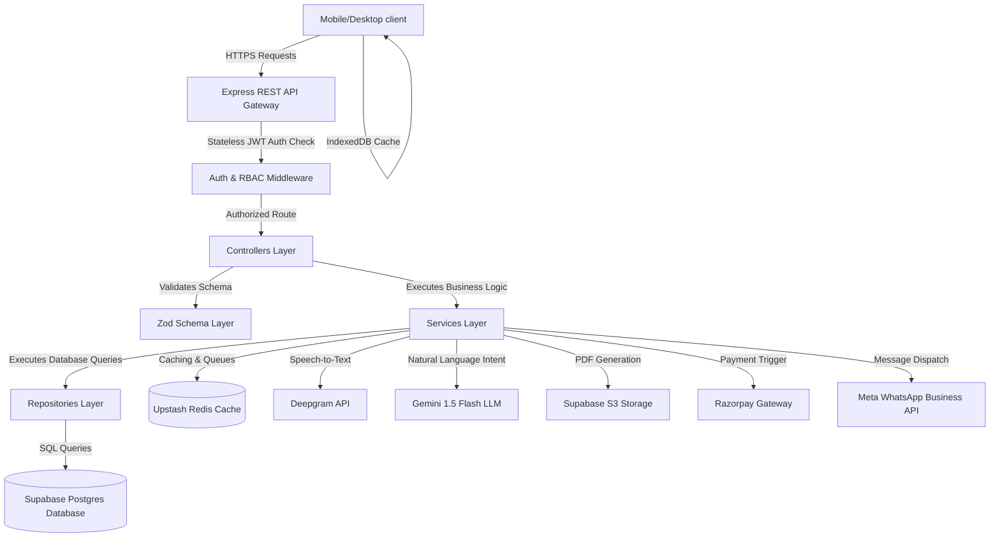
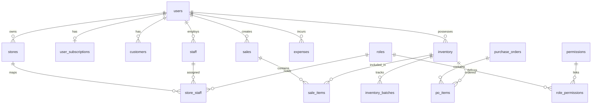
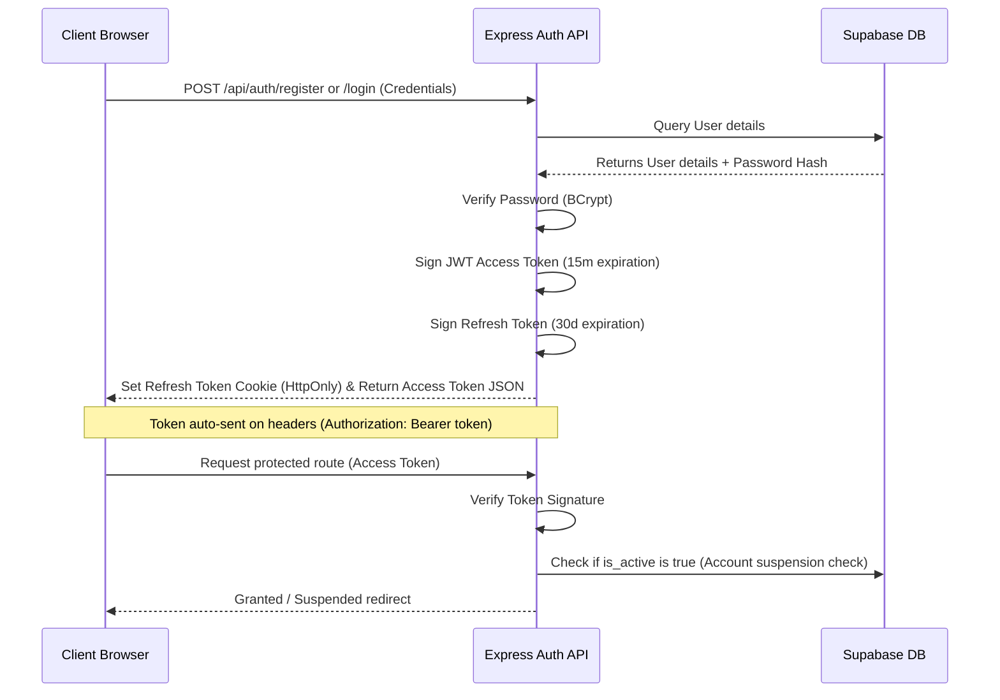
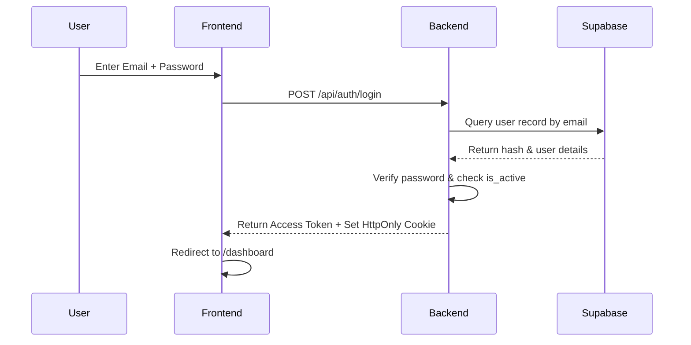
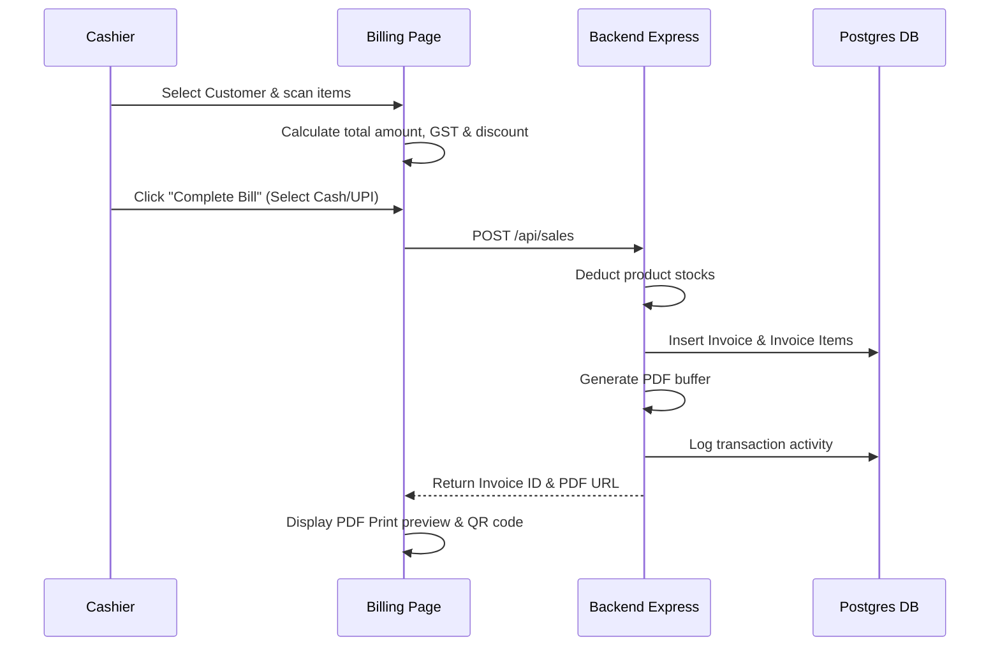

# 🧠 FinSathi — Smart Business Management System (Intelligent Business OS)

Welcome to the **FinSathi BRAIN.md**. This document serves as the permanent source of truth, memory, and cognitive blueprint for the entire repository. Every AI assistant, developer, and architect working on this codebase must read this file first and update it immediately when any part of the system changes.

---

## 📌 Table of Contents
1. [Project Overview](#1-project-overview)
2. [Tech Stack](#2-tech-stack)
3. [High Level Architecture](#3-high-level-architecture)
4. [Folder Structure](#4-folder-structure)
5. [Database Structure](#5-database-structure)
6. [Authentication Flow](#6-authentication-flow)
7. [RBAC (Role Based Access Control)](#7-rbac-role-based-access-control)
8. [Feature List](#8-feature-list)
9. [Business Modules](#9-business-modules)
10. [API Documentation](#10-api-documentation)
11. [AI Architecture](#11-ai-architecture)
12. [Agent Architecture](#12-agent-architecture)
13. [Business Health Score](#13-business-health-score)
14. [Dashboard Architecture](#14-dashboard-architecture)
15. [Workflow Diagrams](#15-workflow-diagrams)
16. [Backend Architecture](#16-backend-architecture)
17. [Frontend Architecture](#17-frontend-architecture)
18. [File Responsibilities](#18-file-responsibilities)
19. [Coding Standards](#19-coding-standards)
20. [Deployment](#20-deployment)
21. [Current Progress](#21-current-progress)
22. [Roadmap](#22-roadmap)
23. [Future Ideas](#23-future-ideas)
24. [Change Log](#24-change-log)
25. [AI Instructions](#25-ai-instructions)

---

## 1. Project Overview

### What is FinSathi?
FinSathi is a mobile-first **Intelligent Business Operating System (OS)** designed specifically for Indian MSMEs (Micro, Small, and Medium Enterprises). It transforms reactive, manual bookkeeping into a proactive, AI-driven management solution.

### Why it Exists
Traditional ERPs and billing tools are designed for desktop-centric, tech-savvy users or accountants. The average Indian shopkeeper (Kirana store owners, distributors, retail operators) relies on paper ledgers (*Khata*) or simple billing apps because existing software is too complex, demands manual data entry, and offers no actionable business advice. FinSathi exists to bridge this gap.

### Problems it Solves
* **Manual Bookkeeping & Human Error:** Replaces offline ledger writing with automatic recording of sales, payments, and expenses.
* **Lack of Financial Visibility:** Translates raw transaction logs into cash flow calendars, P&L statements, and credit ratings.
* **Inventory Mismanagement:** Mitigates stockouts and dead stock through automated threshold alerts and smart reordering.
* **High Accounts Receivable:** Automates due tracking and collections via automated, one-click WhatsApp payment reminders.
* **Underutilized Government Incentives:** Matches businesses with active subsidies (e.g., MUDRA, CGTMSE) using demographic and financial data.

### Target Users
* **Kirana Store Owners & Retail Shopkeepers**
* **Local Distributors & Wholesalers**
* **Service Providers & Small Businesses**
* **Non-technical users** who prefer voice commands in regional languages (Hindi/Hinglish) over navigating complex UI tabs.

### Vision & Core Principles
* **Save Time:** Reduce invoice checkout times to under 10 seconds.
* **Make Money:** Surface upsell opportunities, high-margin products, and match unclaimed government subsidies.
* **Prevent Mistakes:** Detect fraud, invoice duplication, off-hours cash leakage, and predict working capital crunches 14 days in advance.

---

## 2. Tech Stack

| Layer | Technology | Purpose |
| :--- | :--- | :--- |
| **Frontend Framework** | React 18 + Vite 5 | Single Page Application (SPA) with route-based code-splitting |
| **State: Server State** | TanStack Query v5 (React Query) | Handles API data fetching, caching, automatic polling, and mutations |
| **State: Client State** | Zustand v4 | Manages global UI elements (Sidebar collapse, Theme settings, Command Palette) |
| **Routing** | React Router v6 | Client-side routing, protected routes, and page navigation |
| **Form Handling** | React Hook Form + Zod | Schema-validated, high-performance form bindings |
| **Charts & Visuals** | Recharts | Renders interactive sales trends, P&L margins, and cash flow forecasts |
| **Command Palette** | cmdk | Omnipresent keyboard search bar (`Ctrl+K`) for rapid navigation |
| **Virtualization** | TanStack Virtual | Renders only visible rows to support long lists on low-end mobile devices |
| **Offline Cache** | Dexie.js (IndexedDB wrapper) | In-browser store database for offline POS billing capabilities |
| **PDF Generation** | @react-pdf/renderer | Compiles serverless PDF buffers in JavaScript within ~200ms |
| **PWA Core** | Vite PWA Plugin | Configures local service workers and manifest details for app installs |
| **Backend Engine** | Node.js 20 + Express 5 | Lightweight, modular REST API server |
| **Primary Database** | Supabase (PostgreSQL 15) | Relational database, transactional persistence, realtime replication |
| **Cache & Job Queue** | Upstash Redis + Bull | Speed optimization and background jobs (WhatsApp templates, crons) |
| **Authentication** | JWT (15-min Access) + Refresh | Stateless tokens with Secure HTTPOnly Cookie fallback rotation |
| **AI Processing** | Deepgram Nova-2 + Gemini 1.5 Flash | Nova-2 handles Hinglish voice transcription; Gemini extracts intents |
| **Error Tracking** | Sentry.io | Automated backend & frontend error capturing |
| **Hosting & Cloud** | Vercel (Frontend), Railway/Render (Backend) | Globally distributed CDN and autoscaling Node environments |

---

## 3. High Level Architecture

FinSathi operates on a modular, multi-tier SaaS model. The following flow outlines the core data pipeline:



### High-Level Workflow Breakdown:
1. **Billing Checkout:** Frontend sends checkout items -> Backend calculates SGST/CGST/IGST -> Updates inventory stock -> Generates invoice PDF -> Enqueues WhatsApp reminder via Redis Queue.
2. **FinVoice AI Query:** User records speech -> Audio sent to `/api/ai/voice` -> Transcribed by Deepgram -> Structured JSON intent parsed by Gemini -> Backend executes the SQL query -> Result compiled by Gemini into a warm, natural Hinglish response.
3. **Daily Business Brief:** A cron job runs daily -> Triggers `HealthScoreService` and metrics calculator -> Compiles KPIs -> Formulates context -> Gemini generates 3 actionable coaching items -> Caches results in `daily_business_briefs` for immediate user display on dashboard load.

---

## 4. Folder Structure

The project is structured into a clean monorepo containing `backend`, `frontend`, and `database` directories.

```
FinSathi/
├── backend/                 # Node.js + Express backend server
│   ├── src/
│   │   ├── admin/           # Superadmin admin panel controllers/routes
│   │   ├── config/          # DB connections, Supabase client initialization
│   │   ├── constants/       # Global constants, error codes, tax brackets
│   │   ├── controllers/     # HTTP Request/Response handlers
│   │   ├── lib/             # Third-party wrappers (Razorpay, Deepgram)
│   │   ├── middleware/      # Auth, RBAC, Rate-limit, Sentry logging
│   │   ├── repositories/    # Direct database access layer (Raw queries only)
│   │   ├── routes/          # Express route definitions
│   │   ├── services/        # Core Business Logic services (calculators, AI)
│   │   ├── utils/           # Helper functions, cron jobs, formatters
│   │   └── server.js        # Express app bootstrapper
│   ├── .env                 # Environment variables (Sentry, Gemini, Db)
│   └── package.json
│
├── database/                # SQL Schemas and migrations
│   ├── migrations/          # Incremental migration scripts (01 to 46)
│   ├── schema.sql           # Consolidated database schema
│   └── public_schema_snapshot.md # Snapshotted descriptions of tables
│
├── frontend/                # React + Vite client application
│   ├── src/
│   │   ├── api/             # API caller functions using axios
│   │   ├── assets/          # Static logos, default placeholders, images
│   │   ├── components/      # UI components (Header, Sidebar, Charts)
│   │   │   └── ui/          # Generic atomic elements (Buttons, Tables, Modals)
│   │   ├── constants/       # Spacing tokens, color maps, theme constants
│   │   ├── contexts/        # Global context models (Theme, Store preference)
│   │   ├── hooks/           # Custom React Query fetching and mutations
│   │   ├── layouts/         # AppLayout containing responsive shells
│   │   ├── pages/           # Route views (Dashboard, POS, Inventory, CRM)
│   │   ├── services/        # Axios base apiClient configuration
│   │   ├── store/           # Zustand state slices (e.g., commandStore)
│   │   ├── styles/          # Tailwind standard overrides and variables
│   │   └── main.jsx         # App mounting, QueryClient initialization
│   ├── tailwind.config.js
│   ├── vite.config.js
│   └── package.json
│
├── package.json             # Root-level runner scripts
└── vercel.json              # Hosting configs
```

---

## 5. Database Structure

FinSathi uses a Supabase-hosted PostgreSQL database. Row-Level Security (RLS) is disabled for backend queries to execute operations via the Service role, with ownership enforced in the API middleware.



### Table Definitions

#### 1. `users` (Merchant Accounts)
* **PK:** `id` (UUID)
* **Columns:** `email` (TEXT, Unique), `password` (TEXT, BCrypt), `name` (TEXT), `business_name` (TEXT), `business_type` (TEXT), `phone` (TEXT), `city` (TEXT), `state` (TEXT), `address` (TEXT), `gstin` (TEXT), `logo_url` (TEXT), `upi_id` (TEXT), `payment_qr_url` (TEXT), `invoice_terms` (TEXT), `is_active` (BOOLEAN), `created_at` (TIMESTAMPTZ)

#### 2. `stores` (Multi-location branches)
* **PK:** `id` (UUID)
* **FK:** `user_id` -> `users.id`
* **Columns:** `name` (TEXT), `address` (TEXT), `phone` (TEXT), `gstin` (TEXT), `is_active` (BOOLEAN), `created_at` (TIMESTAMPTZ)

#### 3. `roles` (System RBAC Roles)
* **PK:** `id` (UUID)
* **Columns:** `name` (TEXT, Unique: 'Owner', 'Manager', 'Cashier', 'Accountant', 'Warehouse Staff', 'Delivery Staff'), `description` (TEXT), `created_at` (TIMESTAMPTZ)

#### 4. `store_staff` (Role-to-Branch Association)
* **PK:** `id` (UUID)
* **FKs:** `store_id` -> `stores.id`, `staff_id` -> `staff.id`, `role_id` -> `roles.id`
* **Constraints:** Unique on `(store_id, staff_id)`

#### 5. `permissions` (Granular Access Tokens)
* **PK:** `id` (UUID)
* **Columns:** `key` (TEXT, Unique: e.g., 'create_sales', 'delete_inventory'), `label` (TEXT)

#### 6. `role_permissions` (Access Matrix)
* **PK:** `(role_id, permission_id)`
* **FKs:** `role_id` -> `roles.id`, `permission_id` -> `permissions.id`

#### 7. `user_permissions` (Granular Overrides)
* **PK:** `id` (UUID)
* **FKs:** `staff_id` -> `staff.id`, `permission_id` -> `permissions.id`
* **Constraints:** Unique on `(staff_id, permission_id)`

#### 8. `inventory` (Product Catalog)
* **PK:** `id` (UUID)
* **FKs:** `user_id` -> `users.id`, `store_id` -> `stores.id`
* **Columns:** `sku` (TEXT), `name` (TEXT), `description` (TEXT), `company` (TEXT), `price` (NUMERIC), `cost_price` (NUMERIC), `wholesale_price` (NUMERIC), `stock` (INTEGER), `gst_percent` (NUMERIC), `low_stock_threshold` (INTEGER), `units` (TEXT, e.g., 'pcs', 'kg'), `image_url` (TEXT), `created_at` (TIMESTAMPTZ)

#### 9. `inventory_batches` (Expiring stock / Specific restocks)
* **PK:** `id` (SERIAL)
* **FK:** `inventory_id` -> `inventory.id`
* **Columns:** `batch_name` (TEXT), `sku_variant` (TEXT), `cost_price` (NUMERIC), `selling_price` (NUMERIC), `wholesale_price` (NUMERIC), `stock` (INTEGER)

#### 10. `sales` (Invoices/Bills)
* **PK:** `id` (UUID)
* **FKs:** `user_id` -> `users.id`, `customer_id` -> `customers.id`, `store_id` -> `stores.id`
* **Columns:** `invoice_no` (TEXT), `date` (TIMESTAMPTZ), `total` (NUMERIC), `subtotal` (NUMERIC), `tax_amount` (NUMERIC), `discount_percent` (NUMERIC), `amount_paid` (NUMERIC), `payment_status` (TEXT), `payment_method` (TEXT), `notes` (TEXT), `items` (JSONB), `whatsapp_status` (TEXT), `whatsapp_message_id` (TEXT), `last_reminder_sent` (TIMESTAMPTZ), `due_date` (DATE)

#### 11. `sale_items` (Invoice Line Items)
* **PK:** `id` (UUID)
* **FKs:** `sale_id` -> `sales.id`, `product_id` -> `inventory.id`
* **Columns:** `product_name` (TEXT), `quantity` (INTEGER), `price` (NUMERIC), `tax_percent` (NUMERIC), `total` (NUMERIC)

#### 12. `expenses` (Cash Outflows)
* **PK:** `id` (UUID)
* **FKs:** `user_id` -> `users.id`, `supplier_id` -> `suppliers.id`, `store_id` -> `stores.id`
* **Columns:** `amount` (NUMERIC), `category` (TEXT), `date` (TIMESTAMPTZ), `description` (TEXT)

---

## 6. Authentication Flow

FinSathi uses a custom JWT-based authentication system backed by Supabase storage tables.



---

## 7. RBAC (Role Based Access Control)

FinSathi features an Enterprise-grade Role-Based Access Control system mapped at the branch level.

### Permission Matrix

| Role | POS Billing | Manage Inventory | Add Staff | View Financials | Approve Refunds |
| :--- | :---: | :---: | :---: | :---: | :---: |
| **Owner** | Yes (Bypass) | Yes (Bypass) | Yes (Bypass) | Yes (Bypass) | Yes (Bypass) |
| **Manager** | Yes | Yes | Yes | Yes | Yes |
| **Cashier** | Yes | View Only | No | No | No (Requires approval) |
| **Accountant** | No | No | No | Yes | No |
| **Warehouse** | No | Yes | No | No | No |
| **Delivery** | No | View Only | No | No | No |

### Authorization Mechanism
1. **Token Payload:** The login payload returns `req.user` details. If a user is a staff employee, a `staffId` is attached to the token.
2. **Bypass Rule:** If `req.user.staffId` is undefined, the request belongs to the Business Owner account, bypassing all access restrictions.
3. **Override Check:** The system looks up `user_permissions` table. If the staff ID has a direct mapping to the required permission ID, access is granted.
4. **Store-Scoped Check:** The active store context is pulled. The system checks `store_staff` to resolve the role of the employee in that specific branch.
5. **Role Check:** The role is checked against `role_permissions` for the target action.

---

## 8. Feature List

### Completed Features
* **POS Billing Terminal:** Real-time customer search, dynamic barcode inputs, tax calculation, payment status flags, and inventory decrementing triggers.
* **Smart Business Health Score:** Algorithmic calculation of a business rating (0-100) across 5 parameters, providing 3 daily recommendations.
* **FinVoice Voice AI:** Hindi and Hinglish voice question inputs transcribed with Deepgram and resolved with Gemini Flash.
* **14-day Cash Flow Forecast:** Daily trend lines detailing expected payouts, cash inflows, payroll requirements, and cash crunch alerts.
* **CIBIL-style Credit Scoring:** Multi-variable calculations to evaluate business credit ratings (300-900).
* **Multi-Store Management:** Supports creation of multiple store branches, scoping inventory, sales, and employee accounts.
* **Automated WhatsApp Reminders:** Meta WhatsApp integration for sending invoice payment notifications with Razorpay checkout links.

### In Progress
* **Offline Billing Sync:** Sync queue setup using IndexDB to buffer billing invoices without network connectivity.
* **GST Report Exporter:** Direct generation of GSTR-1 and GSTR-3B summaries in Excel formats.

### Planned
* **OCR-based Purchase Invoicing:** Photo upload scans of paper bills to extract suppliers, batch rates, and auto-restock catalogs.
* **Voice-Guided Checkout:** Commands like *"1 kg wheat added to Amit"* to completely build invoices hands-free.

---

## 9. Business Modules

* **Invoices:** Creates custom receipts, adds taxes (CGST, SGST, IGST), applies discounts, tracks payment status (`paid`, `unpaid`, `partial`, `overdue`), and outputs PDF buffers.
* **Customers:** Manages contact ledgers, records individual payment transactions, calculates outstanding debt, and tracks customer cities.
* **Inventory & Batches:** Records product SKUs, tracks quantities, defines restocking thresholds, groups lots into batches with separate cost and wholesale rates.
* **Expenses & Suppliers:** Logs business payouts, groups expenses by category, maps suppliers, and supports purchase order drafts.
* **Workforce:** Tracks employee lists, kiosk QR-code check-ins, monthly salary structures, attendance statuses, and payroll records.

---

## 10. API Documentation

### 1. Authentication Endpoints
* **`POST /api/auth/register`**
  * **Auth:** Public
  * **Body:** `{ email, password, name, business_name, phone }`
  * **Response:** `{ success: true, token, user }`
* **`POST /api/auth/login`**
  * **Auth:** Public
  * **Body:** `{ email, password }`
  * **Response:** `{ success: true, token }`
* **`GET /api/auth/me`**
  * **Auth:** JWT Access Token
  * **Response:** `{ success: true, data: { id, email, name, business_name, gstin, ... } }`

### 2. AI & Intelligence Endpoints
* **`POST /api/ai/query`**
  * **Auth:** JWT Access Token
  * **Body:** `{ query: "Aaj kitna sales hua?" }`
  * **Response:** `{ success: true, data: { intent, summary, data: { total, count, trend }, chartType } }`
* **`GET /api/intelligence/health-score`**
  * **Auth:** JWT Access Token
  * **Response:** `{ success: true, data: { score, riskLevel, components: { sales, cashFlow, ... }, recommendations } }`
* **`GET /api/intelligence/cashflow`**
  * **Auth:** JWT Access Token
  * **Response:** `{ success: true, data: { startingBalance, projectedBalance14Days, cashCrunchDetected, dailyProjections } }`
* **`GET /api/intelligence/credit`**
  * **Auth:** JWT Access Token
  * **Response:** `{ success: true, data: { score, rating, metrics: { dscr, workingCapitalRatio, dso }, explanation } }`

### 3. POS Billing & Inventory Endpoints
* **`POST /api/sales`**
  * **Auth:** JWT Access Token (Requires `create_sales` permission)
  * **Body:** `{ customer_id, items: [{ productId, quantity, price }], discount_percent, payment_method, payment_status }`
  * **Response:** `{ success: true, data: { id, invoice_no, total, tax_amount } }`
* **`GET /api/inventory`**
  * **Auth:** JWT Access Token (Requires `view_inventory` permission)
  * **Response:** `{ success: true, data: [{ id, name, stock, low_stock_threshold, price }] }`

---

## 11. AI Architecture

FinSathi implements an "Action-Guarded" LLM architecture. The model is strictly prohibited from running direct database mutations or generating SQL strings.

```
[User Input Query]
       │
       ▼
[Deepgram Nova-2] (Voice transcription if audio)
       │
       ▼
[Gemini 1.5 Flash] ──(Extracts Intent JSON only)
       │
       ▼
[Node.js Backend] ──(Checks access control -> Runs parameterized SQL via repositories)
       │
       ▼
[Gemini 1.5 Flash] ──(Translates raw SQL dataset -> Conversational response)
       │
       ▼
[Client UI] ──(Renders Text summary + charts)
```

### Context Builder Pipeline
When a user asks a question, the API generates a context snapshot including:
1. Today's date and day of the week.
2. The user's business name and profile status.
3. Name lists of the top 10 customers and top 10 products (for fuzzy spelling matches).

---

## 12. Agent Architecture

FinSathi supports cooperative, narrow-scope AI agent engines.

* **Invoice Agent:** Parses voice commands to construct draft invoices (e.g., *"Amit ko 2 packet doodh aur 5kg cheeni add karo"*). Resolves product and customer names from the local IndexedDB cache.
* **Inventory Agent:** Runs daily checks on stock values, flags slow-moving items (dead stock), calculates reorder quantities using historical rates, and drafts purchase orders.
* **Finance Agent:** Computes the credit scores, tracks outstanding ledger balances, and runs the cash flow forecasting algorithms.
* **Compliance Agent:** Evaluates GSTR metrics, flags high tax-bracket sales, and checks business profile compliance.

---

## 13. Business Health Score

The Health Score service (`HealthScoreService.js`) calculates a comprehensive business performance rating (0-100) using a multi-factor formula.

### Calculation Breakdown

$$\text{Health Score} = (\text{Sales} \times 0.30) + (\text{Cash Flow} \times 0.25) + (\text{Inventory} \times 0.20) + (\text{Collection} \times 0.15) + (\text{Profile} \times 0.10)$$

* **Sales Performance (30%):** Measures month-over-month growth. Growth $\ge 15\%$ yields a score of 100; negative growth reduces it proportionally.
* **Cash Flow Health (25%):** Evaluates the expense-to-sales ratio. A ratio $\le 0.3$ yields 100; ratios exceeding 1.0 drop the score to 30 or lower.
* **Inventory Health (20%):** Calculated as the average of Low Stock and Dead Stock ratios:
  $$\text{Inventory Score} = \frac{\max(0, 100 - (\text{Low Stock Ratio} \times 150)) + \max(0, 100 - (\text{Dead Stock Ratio} \times 150))}{2}$$
* **Collection Health (15%):** Measured as the percentage of cash collected from total invoiced sales over the last 30 days.
* **Profile Completeness (10%):** The ratio of filled profile fields (GSTIN, UPI, address, logo, etc.) to total profile settings.

---

## 14. Dashboard Architecture

The dashboard acts as the command center for the merchant.

* **KPI metrics cards:** 4 main cards displaying Today's Revenue, Monthly Revenue, Active Catalog Items, and Pending Balances.
* **Visualization charts:** Sales trends (Line chart) and product performance (Bar chart) rendered dynamically with Recharts.
* **FinSathi Health SVG widget:** A radial progress bar showing the business health score and listing 3 daily action tasks.
* **Caching:** Server states are cached using TanStack Query. Refetches occur when moving between pages, on manual pull-to-refresh events, or when mutate actions occur.

---

## 15. Workflow Diagrams

### 1. User Login Flow


### 2. POS Billing Flow


### 3. Automated Collections Flow
```mermaid
cronJob->>Backend: Trigger Reminder Cron (Daily)
Backend->>DB: Query sales where payment_status = unpaid and due_date < today
DB-->>Backend: Return overdue invoices + customer phones
loop For each invoice
    Backend->>Backend: Create Razorpay Payment Link
    Backend->>Meta API: POST /messages (Template: due invoice)
    Meta API-->>Backend: Return message ID
    Backend->>DB: Update last_reminder_sent & status to 'sent'
end
```

---

## 16. Backend Architecture

FinSathi follows the **Controller -> Service -> Repository** architectural pattern.

* **Routes:** Receives client requests, applies rate limiters, verifies tokens, and calls the appropriate controller handler.
* **Controllers:** Extracts request parameters, parses payloads, forwards them to services, and standardizes Express responses:
  ```json
  {
    "success": true,
    "data": {},
    "message": "Resource fetched successfully"
  }
  ```
* **Services:** Handles all business logic, tax calculations, health score aggregations, AI prompt assemblies, and external API requests.
* **Repositories:** Performs database queries. Controllers and services must not call Supabase or run SQL directly; they delegate to the repository layer.
* **Error Handling:** Standardized using express error handlers, logging trace reports directly to Sentry.

---

## 17. Frontend Architecture

The frontend is a lightweight, responsive React SPA optimized for mobile viewports.

* **Pages:** Dynamic page components lazy-loaded via `React.lazy` and wrapped in `Suspense` routers to minimize initial bundle size.
* **AppLayout:** The root layout containing the persistent navigation sidebar for desktop layouts, a bottom action bar for mobile layouts, and store preference toggles.
* **UI Components:** Reusable design tokens stored in `src/components/ui/` (Buttons, Cards, Inputs, Tables) utilizing CSS variables to maintain styling consistency.
* **React Query Hooks:** Custom hooks (e.g., `useInvoices`, `useInventory`) that manage server-state fetching and cache invalidation.

---

## 18. File Responsibilities

| File Path | Responsibility | Key Exports | Consumers |
| :--- | :--- | :--- | :--- |
| [`server.js`](file:///d:/Projects/FinSathi/backend/src/server.js) | Boots Express server, mounts middleware, and registers routes. | `app` | Node runtime |
| [`authMiddleware.js`](file:///d:/Projects/FinSathi/backend/src/middleware/authMiddleware.js) | Validates JWT signatures and verifies active status. | `authenticateToken` | Express private routes |
| [`rbacMiddleware.js`](file:///d:/Projects/FinSathi/backend/src/middleware/rbacMiddleware.js) | Evaluates permissions and applies store-staff role overrides. | `enforcePermissions` | Protected routes |
| [`AIService.js`](file:///d:/Projects/FinSathi/backend/src/services/AIService.js) | Handles AI processing, intent categorization, and Hinglish output formatting. | `AIService` | AI Controller |
| [`HealthScoreService.js`](file:///d:/Projects/FinSathi/backend/src/services/HealthScoreService.js) | Computes health scores and generates daily merchant recommendations. | `HealthScoreService` | Daily Cron, intelligence routes |
| [`CashFlowService.js`](file:///d:/Projects/FinSathi/backend/src/services/CashFlowService.js) | Generates 14-day cash flow projections and crunch warnings. | `CashFlowService` | Cash Flow widgets |
| [`apiClient.js`](file:///d:/Projects/FinSathi/frontend/src/services/apiClient.js) | Configures Axios interceptors, handles auth header injections, and redirects on 401/403 errors. | `API` | Frontend API modules |
| [`commandStore.js`](file:///d:/Projects/FinSathi/frontend/src/store/commandStore.js) | Manages Command Palette visibility and state triggers. | `useCommandPaletteStore` | Command Palette component |

---

## 19. Coding Standards

### Naming Conventions
* **Frontend:** Use PascalCase for React component files (`BillingMetrics.jsx`), camelCase for utility files and hooks (`useInvoices.js`).
* **Backend:** Use camelCase for controller and routing files (`salesRoutes.js`), PascalCase for services and repositories (`SalesService.js`, `SalesRepository.js`).
* **Database:** Use snake_case for tables, columns, and foreign keys (`payment_status`, `discount_percent`).

### Financial Standards
* **Money Representation:** Financial values must be calculated in decimal format at the service layer, but stored as integers in **Paise** (amount * 100) when interfacing with gateways like Razorpay to avoid floating-point inaccuracies.

### Error Handling
* Avoid empty catch blocks. Always log errors with descriptive context or report them using `console.error` and Sentry alerts.

---

## 20. Deployment

### Environment Variables

#### Backend (`backend/.env`)
```env
PORT=5001
SUPABASE_URL=https://your-project-id.supabase.co
SUPABASE_KEY=your-anon-public-key
SUPABASE_SERVICE_ROLE_KEY=your-service-role-key
JWT_SECRET=your-secure-jwt-signature-key
GEMINI_API_KEY=your-gemini-key
DEEPGRAM_API_KEY=your-deepgram-key
RAZORPAY_KEY_ID=your-razorpay-id
RAZORPAY_KEY_SECRET=your-razorpay-secret
```

#### Frontend (`frontend/.env`)
```env
VITE_API_URL=https://api.finsathi.com/api
VITE_SUPABASE_URL=https://your-project-id.supabase.co
VITE_SUPABASE_KEY=your-anon-public-key
```

### Hosting Architecture
* **Frontend Hosting:** Vercel (Single Page App deployment configuration).
* **Backend Hosting:** Railway or Render Node.js environment.
* **Database Platform:** Supabase PostgreSQL instance.
* **Static Assets:** Supabase Storage bucket (`finsathi-assets`).

---

## 21. Current Progress

* **Overall Project Completion:** ~80%
* **Completed Modules:** Auth, POS Billing, Inventory batches, Staff attendance, Cash flow forecasts, Business health scoring, AI voice advisor (Hinglish/English), Multi-store contexts.
* **Active Tasks:** Offline billing IndexedDB queue sync, automated GSTR spreadsheet summaries.
* **Technical Debt:**
  * Clean up legacy `sales` column queries and standardise all endpoints to use `SalesRepository`.
  * Replace the remaining `useEffect` fetches on historical reporting pages with React Query hooks.

---

## 22. Roadmap

* **Version 1.0 (Completed):** Multi-tenant billing, inventory records, and expense trackers.
* **Version 2.0 (Active):** Hinglish AI voice support, cash flow forecasts, WhatsApp notifications, and multi-store settings.
* **Version 3.0 (Planned):** OCR invoice parsing, barcode-based product additions, and automated CA accounting exports.
* **Enterprise Edition (Planned):** Warehouse distribution logs, logistics dispatch trackers, and branch-level inventory transfer request flows.

---

## 23. Future Ideas

* **Predictive Stocking:** Uses sales history to predict product demands before seasonal spikes.
* **Voice Billing Assistant:** Hands-free checkout operations using voice commands in regional Indian dialects.
* **OCR purchase intake:** Snaps pictures of paper invoices to automatically log stock and restock batches.
* **WhatsApp Commerce storefront:** Allows wholesalers to share product catalogs via WhatsApp and receive client orders directly into FinSathi.

---

## 24. Change Log

| Date | Feature | Files Modified | Reason | Impact |
| :--- | :--- | :--- | :--- | :--- |
| **2026-06-26** | Production Bundle Optimization | `Topbar.jsx`, `GeneralPage.jsx`, `pwa-192x192.png` | Lazy-loaded jsPDF and settings tabs, resized PWA 192x192 icon. | Reduced initial layout chunk and GeneralPage chunk sizes, optimized pre-cache weight. |
| **2026-06-26** | Formatting Standardization | `formatNumbers.js`, `DashboardMetrics.jsx`, `BillingMetrics.jsx`, `InvoiceDrawer.jsx` | Created centralized currency/number helpers and refactored metrics components. | Removed duplicate inline formatting logic. |
| **2026-06-26** | Timezone Utility Refactoring | `dateTime.js`, `AnomalyService.js` | Created centralized timezone utility and refactored AnomalyService. | Improved codebase robustness and prevented future timezone bugs. |
| **2026-06-26** | Timezone Correction (BUG-002) | `AnomalyService.js` | Enforce Indian Standard Time (IST) in business hours anomaly calculations. | Eliminated false off-hours billing flags for Indian merchants. |
| **2026-06-25** | Created BRAIN.md | `BRAIN.md` | Standardise repository memory. | Improved development onboarding and AI assistant operations. |
| **2026-05-18** | Multi-Store context | `server.js`, `storeRoutes.js`, `rbacMiddleware.js` | Support multi-branch stores. | Scoped inventory, staff, and sales by store locations. |
| **2026-04-12** | Voice query parsing | `aiRoutes.js`, `AIService.js`, `FinVoiceWidget.jsx` | Support natural language inputs. | Enabled Hindi and Hinglish voice transcriptions. |

---

## 25. AI Instructions

All AI assistants working on this repository must adhere to the following rules:

1. **Maintain documentation integrity:** Do not delete existing code documentation, comments, or docstrings.
2. **Never duplicate code:** Prioritize reusing components from `src/components/ui/` and standard helper functions from `src/utils/`.
3. **Database Guardrails:** Do not write code that allows the LLM to generate raw SQL queries or write directly to the database. Database interactions must be routed through repositories and validate user ownership.
4. **Update BRAIN.md:** Update this document immediately if folder structures, database tables, API routes, or features are modified.
5. **Enforce API contract:** Ensure all backend API responses adhere to the standard JSON format:
   ```json
   {
     "success": true,
     "data": {},
     "error": null
   }
   ```
