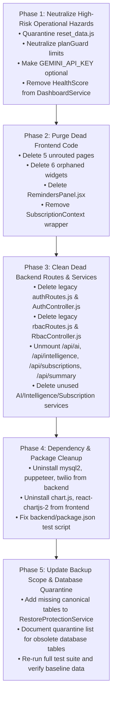

# KaroBar Cleanup Audit

> **Audit Type:** Full Repository Stabilization, Duplication & Dead Code Audit  
> **Status:** AUDIT ONLY (Zero Code Modifications Performed)  
> **Repository:** `Piyush5621/FinSathi` (`e:\Projects\FinSathi`)  
> **Date:** September 25, 2026

---

## 1. Repository Summary

KaroBar is a retail and wholesale operating system built with:
- **Frontend:** React 19, Vite 7, TailwindCSS 3, Lucide React, Recharts, Workbox PWA.
- **Backend:** Node.js (ESM), Express 4, PostgreSQL (via Supabase and native `pg` pool), BullMQ / Redis (optional async publisher), Winston logging.
- **Authoritative Database:** PostgreSQL with 106 public schema tables, foreign key constraints, and partial indexes.

### Core Protected Features (1–12):
1. Auth & Business Setup
2. POS Billing Terminal
3. Sales & Invoice History
4. Product & Inventory Catalog
5. Purchases & Supplier Hub
6. Customer Khata & Credit Ledger
7. Expenses & Cashbook
8. GST Compliance (GSTR-1, GSTR-3B)
9. Executive Analytics & Reports
10. Staff & Access Control (RBAC, PIN Terminal)
11. Settings & Administration
12. Superadmin Operations

### Permanently Removed Features:
- Business Health Score
- AI / FinVoice
- Smart Alerts / Autopilot
- Subscription / Monetization
- CRM (Leads & Notes)
- Tasks
- Government Schemes
- HR / Payroll
- Business Network / B2B Trade
- Utility Hub

---

## 2. Backend Findings

### Finding B-1: Unmounted Legacy Auth Controller & Route
- **File:** `backend/src/routes/authRoutes.js` and `backend/src/controllers/AuthController.js`
- **Finding:** Fully implemented auth router and controller that are never imported or mounted in `server.js`. The identity domain is handled canonically by `backend/src/modules/identity/`.
- **Classification:** DEAD
- **Evidence:** `server.js` imports `identityRouter` from `modules/identity/index.js`. `authRoutes.js` is never imported. `backend/src/controllers/AuthController.js` is only referenced by `authRoutes.js`.
- **Risk:** Developer confusion; risk of accidental resurrection or inconsistent password hashing logic.
- **Recommended Action:** Safely delete `backend/src/routes/authRoutes.js` and `backend/src/controllers/AuthController.js`.

### Finding B-2: Unmounted Legacy RBAC Controller & Route
- **File:** `backend/src/routes/rbacRoutes.js` and `backend/src/controllers/RbacController.js`
- **Finding:** Legacy RBAC controller and routes that are not mounted in `server.js`. RBAC endpoints are canonically served by `modules/identity/routes.js`.
- **Classification:** DEAD
- **Evidence:** `server.js` mounts `identityRouter` at `/api/v1` and `/api`. `rbacRoutes.js` is never imported in `server.js`.
- **Risk:** Dual definition of permission endpoints.
- **Recommended Action:** Safely delete `backend/src/routes/rbacRoutes.js` and `backend/src/controllers/RbacController.js`.

### Finding B-3: Dead Summary Controller, Route, and Service
- **File:** `backend/src/routes/summaryRoutes.js`, `backend/src/controllers/SummaryController.js`, `backend/src/services/SummaryService.js`
- **Finding:** Generates weekly growth summaries and insight strings. Frontend `Dashboard.jsx` does not consume this; dashboard metrics are served canonically by `/api/dashboard` and `/api/analytics/`.
- **Classification:** DEAD
- **Evidence:** `frontend/src/hooks/useDashboard.js` exports `useSummary` which calls `/summary`, but `useSummary` is never imported in any UI component.
- **Risk:** Unnecessary endpoint exposed on `/api/summary`.
- **Recommended Action:** Unmount from `server.js` and remove files.

### Finding B-4: Dangerous Unprotected Database Wipe Script
- **File:** `backend/src/scripts/reset_data.js`
- **Finding:** A standalone script that deletes all records from `sale_items`, `payments`, `sales`, `inventory_batches`, and `inventory` using a dummy filter (`neq("quantity", -999999)`). Has zero password checks or confirmation prompts.
- **Classification:** HIGH-RISK
- **Evidence:** Directly imports Supabase and calls `.delete()` across all primary tables.
- **Risk:** Accidental execution in production completely destroys business data.
- **Recommended Action:** Immediately quarantine or delete this script.

### Finding B-5: Mandatory GEMINI_API_KEY in Startup Environment Validator
- **File:** `backend/src/infrastructure/config/envValidator.js`
- **Finding:** `envValidator.js` strictly requires `GEMINI_API_KEY: z.string().min(1)`. If missing, the process exits with `process.exit(1)`.
- **Classification:** HIGH-RISK
- **Evidence:** `envSchema` line 18 enforces `GEMINI_API_KEY`. AI/FinVoice is a permanently removed feature.
- **Risk:** Server crashes on startup if third-party Gemini API key is absent, even though AI is disabled.
- **Recommended Action:** Make `GEMINI_API_KEY` optional or remove it from `envValidator.js`.

### Finding B-6: Broken npm test Script in backend/package.json
- **File:** `backend/package.json`
- **Finding:** The `test` script in `backend/package.json` attempts to run 23 nonexistent test files (e.g., `tests/b2b_network_endpoints_live.test.js`, `tests/staff_payroll_breakdown_flow.test.js`).
- **Classification:** DEAD
- **Evidence:** `npm test` fails immediately because referenced files in `tests/` do not exist. Active tests reside in `backend/tests/`.
- **Risk:** CI/CD test execution fails.
- **Recommended Action:** Update `backend/package.json` test script to execute the canonical test suite (`final_product_verification.test.js` or `node --test backend/tests/*.test.js`).

### Finding B-7: Dummy Seed File
- **File:** `backend/src/database/seed/seed.js`
- **Finding:** Skeleton file with empty commented functions (`// await db.users.insert(...)`).
- **Classification:** DEAD
- **Evidence:** Contains no executable seeding logic.
- **Risk:** Clutter and confusion.
- **Recommended Action:** Delete `backend/src/database/seed/seed.js`.

---

## 3. Frontend Findings

### Finding F-1: Unrouted Dead Page Modules
- **Files:**
  - `frontend/src/pages/AiAdvisorPage.jsx` (684 lines)
  - `frontend/src/pages/BusinessHealthPage.jsx` (230 lines)
  - `frontend/src/pages/Subscription/Plans.jsx` (180 lines)
  - `frontend/src/pages/Alerts/AlertsAutomationCenter.jsx` (535 lines)
  - `frontend/src/pages/Analytics/MultiStoreIntelligenceCenter.jsx` (613 lines)
- **Finding:** Complete page files from permanently removed features remain in `frontend/src/pages/`. None are imported in `App.jsx` or any active component.
- **Classification:** DEAD
- **Evidence:** Global search confirms zero imports. `App.jsx` redirects their URL paths to `/dashboard`, `/executive-analytics`, or `/settings`.
- **Risk:** Dead code bloating the repository (~2,200 lines) and causing cognitive overhead.
- **Recommended Action:** Safely delete all 5 orphaned page files.

### Finding F-2: Orphaned Dashboard Widgets
- **Files:**
  - `frontend/src/components/Dashboard/AiAdvisorHero.jsx`
  - `frontend/src/components/Dashboard/AnomalyBanner.jsx`
  - `frontend/src/components/Dashboard/CreditScoreCard.jsx`
  - `frontend/src/components/Dashboard/HealthScoreHero.jsx`
  - `frontend/src/components/Dashboard/HealthScoreWidget.jsx`
  - `frontend/src/components/Dashboard/CashFlowWidget.jsx`
- **Finding:** Components created for removed AI, Anomaly, Credit Score, and Health Score features. None are imported by `Dashboard.jsx` or any other file.
- **Classification:** DEAD
- **Evidence:** Zero import statements found across `frontend/src/`.
- **Risk:** Dead bundle weight and confusion during UI maintenance.
- **Recommended Action:** Safely delete all 6 orphaned component files.

### Finding F-3: Dead Duplicate Profile Panel
- **File:** `frontend/src/pages/Profile/RemindersPanel.jsx`
- **Finding:** An isolated component for configuring WhatsApp reminder rules.
- **Classification:** DEAD
- **Evidence:** `Profile.jsx` implements Tab 7 ("Integrations & WhatsApp") directly inline with identical controls. `RemindersPanel.jsx` is never imported.
- **Risk:** Duplication and maintenance divergence.
- **Recommended Action:** Safely delete `RemindersPanel.jsx`.

### Finding F-4: Unused Subscription Context Wrapping Application
- **File:** `frontend/src/contexts/SubscriptionContext.jsx`, `frontend/src/api/subscriptions.js`, `frontend/src/constants/plans.js`
- **Finding:** `SubscriptionProvider` wraps the entire app in `App.jsx` (line 48) and fires a query to `/api/subscriptions/my-plan` on every page load for authenticated users.
- **Classification:** DEAD
- **Evidence:** Subscription/Monetization is removed. The only consumer of `useSubscription` is a small chip in `Sidebar.jsx` (line 25).
- **Risk:** Unnecessary network requests on startup, reliance on removed subscription routes.
- **Recommended Action:** Remove `SubscriptionProvider` wrapper from `App.jsx`, remove subscription chip from `Sidebar.jsx`, and delete subscription context/api files.

### Finding F-5: Unused Dashboard Hook Exports
- **File:** `frontend/src/hooks/useDashboard.js` and `frontend/src/api/dashboard.js`
- **Finding:** `useSummary` and `useSalesSummary` hooks and `getSummary` / `getSalesSummary` API functions.
- **Classification:** DEAD
- **Evidence:** `Dashboard.jsx` only imports and uses `useDashboardData`. The summary functions are unreferenced.
- **Risk:** Unnecessary code maintaining duplicate API hooks.
- **Recommended Action:** Remove unused functions from `useDashboard.js` and `api/dashboard.js`.

---

## 4. Route Findings

### Finding R-1: Mounted Backend Routes for Removed Features
- **Files:** `backend/src/server.js` (lines 140, 176, 179)
- **Finding:** The backend server still mounts:
  - `app.use("/api/subscriptions", subscriptionRoutes);`
  - `app.use("/api/ai", aiLimiter, aiRoutes);`
  - `app.use("/api/intelligence", intelligenceRoutes);`
- **Classification:** DEAD
- **Evidence:** These correspond directly to the permanently removed features. No active frontend component calls these routes.
- **Risk:** Unnecessary public attack surface, unmaintained endpoints exposed.
- **Recommended Action:** Unmount these routes from `server.js` and delete their route/service files.

### Finding R-2: Redundant / Overlapping Route Mounting on /api/catalog
- **File:** `backend/src/server.js` (lines 156, 160, 161, 165, 166, 167)
- **Finding:** Multiple routers are mounted on `/api/catalog` in `server.js`:
  ```javascript
  app.use("/api/catalog", catalogRouter);
  app.use("/api/v1/catalog", catalogRouter);
  app.use("/api/v1", catalogRouter);
  app.use("/api", catalogRouter);
  app.use("/api/catalog", catalogRoutes);
  app.use("/api/public-catalog", catalogRoutes);
  ```
- **Classification:** DUPLICATE
- **Evidence:** `catalogRouter` (`modules/catalog/index.js`) handles `/products/...` with auth, while `catalogRoutes` (`routes/catalogRoutes.js`) handles `/:businessSlug` for public digital catalogs. Mounting both on `/api/catalog` causes route shadowing.
- **Risk:** Ambiguous routing and route collisions if parameters overlap.
- **Recommended Action:** Mount `catalogRouter` canonically on `/api/catalog` and mount public catalog exclusively on `/api/public-catalog`. Remove duplicate `/api/v1` mounts.

### Finding R-3: Redundant Multi-Mount of Inventory Router
- **File:** `backend/src/server.js` (lines 162, 163, 187)
- **Finding:** `inventoryRouter` is mounted at `/api/v1` and `/api`, and then `inventoryRoutes` is mounted at `/api/inventory`.
- **Classification:** DUPLICATE
- **Evidence:** `routes/inventoryRoutes.js` delegates sub-routes (`/restock`, `/adjust`, `/transfer`) to `StockController.js`.
- **Risk:** Dual execution paths for inventory operations.
- **Recommended Action:** Consolidate inventory routes into a single canonical mount at `/api/inventory`.

---

## 5. Duplicate Implementations

### Finding D-1: Customer Repayment Endpoint Duplication
- **Files:** `backend/src/routes/paymentRoutes.js` vs `backend/src/routes/customerRoutes.js`
- **Finding:**
  - Route A: `POST /api/customers/:id/payments` (handled by `CustomerController.recordCustomerPayment` -> `CustomerPaymentService.recordPayment`)
  - Route B: `POST /api/payments/add` (handled by `PaymentController.addPayment` -> `CustomerPaymentService.recordRepayment`)
- **Classification:** DUPLICATE
- **Evidence:** Both delegate to `CustomerPaymentService`, but have separate parameter bindings. `AddPaymentModal.jsx` line 48 contains a ternary selecting either endpoint.
- **Risk:** Double maintenance; testing split across two routes.
- **Recommended Action:** Keep `POST /api/customers/:id/payments` as canonical. Keep `POST /api/payments/add` strictly as a backward-compatibility alias or migrate all callers to the canonical route.

### Finding D-2: Duplicate Sales Summary & Trend Endpoints
- **Files:** `backend/src/routes/salesRoutes.js` vs `backend/src/routes/analyticsRoutes.js`
- **Finding:**
  - `GET /api/sales/summary` vs `GET /api/analytics/sales-summary`
  - `GET /api/sales/trend` vs `GET /api/analytics/sales-trend`
- **Classification:** DUPLICATE
- **Evidence:** `salesRoutes.js` calls `SalesService.getSummary` (which falls back to `dashboard_kpis_view` or raw queries), while `analyticsRoutes.js` calls `AnalyticsService.getSalesSummary` and `AnalyticsService.getSalesTrend`. The frontend UI components (`SalesTrendChart.jsx`, `ExecutiveAnalytics.jsx`) consume `/analytics/...`.
- **Risk:** Discrepancy between analytics numbers if calculated differently.
- **Recommended Action:** Keep `/api/analytics/...` as canonical. Mark `/api/sales/summary` and `/api/sales/trend` as legacy.

### Finding D-3: Duplicate Dual Auth & RBAC Middleware Stacks
- **Files:**
  - Stack 1: `backend/src/middleware/authMiddleware.js` (`authenticateToken`), `backend/src/middleware/rbacMiddleware.js` (`enforcePermissions`)
  - Stack 2: `backend/src/modules/identity/middleware/authMiddleware.js` (`authenticate`, `attachTenant`, `authorize`)
- **Classification:** DUPLICATE
- **Evidence:** Stack 1 is used across standard routes (`server.js` line 170). Stack 2 is used inside `modules/identity`, `modules/catalog`, and `modules/masters`. Both verify JWT tokens and attach user info, but Stack 2 checks `jwt_version` in DB while Stack 1 checks `is_active`.
- **Risk:** Inconsistent session revocation behavior across different API endpoints.
- **Recommended Action:** Unify JWT verification and tenant attachment into a single canonical middleware.

---

## 6. Dead Code

### Finding DC-1: Unused Node Dependencies (Backend)
- **File:** `backend/package.json`
- **Dependencies:**
  1. `"mysql2": "^3.2.0"` — Zero imports in the entire codebase. Database is PostgreSQL.
  2. `"puppeteer": "^24.29.1"` — Zero imports in the entire codebase. PDF generation uses `pdfkit` on backend and `jspdf`/`html2canvas` on frontend.
  3. `"twilio": "^5.13.1"` — Zero active imports (only a commented line in `ReminderService.js`).
- **Classification:** DEAD
- **Evidence:** Full-text regex search across `backend/src/` confirms 0 matches.
- **Risk:** Bloated `node_modules` (~300MB from Puppeteer/Chromium), longer install times, potential dependency vulnerabilities.
- **Recommended Action:** Remove `mysql2`, `puppeteer`, and `twilio` from `backend/package.json`.

### Finding DC-2: Unused UI Dependencies (Frontend)
- **File:** `frontend/package.json`
- **Dependencies:**
  1. `"chart.js": "^4.5.1"` — Zero imports in `frontend/src/`.
  2. `"react-chartjs-2": "^5.3.1"` — Zero imports in `frontend/src/`.
- **Classification:** DEAD
- **Evidence:** All frontend charts (`ExecutiveAnalytics.jsx`, `SalesTrendChart.jsx`, `TopProductsChart.jsx`, `PnlPage.jsx`) exclusively use `recharts`.
- **Risk:** Dead package weight in bundle dependencies.
- **Recommended Action:** Remove `chart.js` and `react-chartjs-2` from `frontend/package.json`.

### Finding DC-3: Obsolete 6-Hour Health Score Cron Job
- **File:** `backend/src/utils/cronJobs.js` (lines 16–19)
- **Finding:**
  ```javascript
  cron.schedule("0 */6 * * *", async () => {
    console.log("[Background Job] Precomputing Business Health Scores...");
  });
  ```
- **Classification:** DEAD
- **Evidence:** Empty cron job logging a message for a removed feature.
- **Risk:** Log pollution.
- **Recommended Action:** Remove the 6-hour cron schedule.

---

## 7. Removed Feature Remnants

| Removed Feature | Lingering Backend Remnants | Lingering Frontend Remnants | Lingering Database Remnants |
| :--- | :--- | :--- | :--- |
| **Business Health Score** | `HealthScoreService.js` (411 lines), `DashboardService.js` (calls `calculateAndLog` on every dashboard fetch), `cronJobs.js` | `BusinessHealthPage.jsx`, `HealthScoreHero.jsx`, `HealthScoreWidget.jsx` | `business_health_metrics` table |
| **AI / FinVoice** | `aiRoutes.js`, `AIService.js` (475 lines), `aiLimiter`, `envValidator.js` requirement for `GEMINI_API_KEY` | `AiAdvisorPage.jsx`, `AiAdvisorHero.jsx` | System AI queue definition in `queueManager.js` |
| **Smart Alerts / Autopilot**| `AnomalyService.js`, `CashFlowService.js`, `DailyBriefService.js`, `CreditRulesService.js`, `intelligenceRoutes.js` | `AlertsAutomationCenter.jsx`, `AnomalyBanner.jsx`, `CashFlowWidget.jsx`, `CreditScoreCard.jsx` | `anomaly_flags`, `daily_business_briefs` tables |
| **Subscription & Monetization** | `subscriptionRoutes.js`, `SubscriptionController.js`, `plans.js`, `planGuard.js` middleware | `Plans.jsx`, `SubscriptionContext.jsx`, `api/subscriptions.js`, `Sidebar.jsx` plan chip | `user_subscriptions`, `subscription_payments`, `usage_tracking` tables |
| **CRM (Leads)** | Referenced in `RestoreProtectionService.js` | None | `leads`, `lead_activities`, `lead_notes` tables |
| **Tasks** | None | None | `tasks` table |
| **Government Schemes** | None | None | `schemes`, `user_scheme_matches` tables, migration 21 |
| **HR / Payroll** | Referenced in `RestoreProtectionService.js` | None | `payroll` table, migration 19 |
| **Business Network / B2B Trade** | Trade seeder in `demoSeed.js`, `create_trade_rpc.sql` | None | 14 tables (`business_connections`, `business_network_profiles`, `trade_transactions`, etc.), migrations 35–42, 47–50 |

---

## 8. Dependency Findings

### Summary Table

| Package | Location | Declared Version | Actual Usage | Status | Recommendation |
| :--- | :--- | :--- | :--- | :--- | :--- |
| `mysql2` | `backend/` | `^3.2.0` | None (0 imports) | DEAD | Uninstall |
| `puppeteer` | `backend/` | `^24.29.1` | None (0 imports) | DEAD | Uninstall |
| `twilio` | `backend/` | `^5.13.1` | None (commented only) | DEAD | Uninstall |
| `chart.js` | `frontend/` | `^4.5.1` | None (0 imports) | DEAD | Uninstall |
| `react-chartjs-2` | `frontend/` | `^5.3.1` | None (0 imports) | DEAD | Uninstall |
| `razorpay` | `backend/` | `^2.9.6` | Used only in removed Subscriptions | REVIEW | Keep until subscription routes unmounted, then uninstall |
| `bullmq` | `backend/` | `^5.79.1` | Optional async queue (fallback to memory) | ACTIVE | Retain |
| `ioredis` | `backend/` | `^5.11.1` | Redis connection for queues & cache | ACTIVE | Retain |
| `pdfkit` | `backend/` | `^0.18.0` | Used in `PdfService.js` | ACTIVE | Retain |
| `xlsx` | `backend/` & `frontend/` | `^0.18.5` | Used in GST Excel exports | ACTIVE | Retain |

---

## 9. Database/Migration Findings

### Finding DB-1: Obsolete Tables from Removed Features
- **Finding:** The PostgreSQL database contains 106 tables. Approximately 25–30 tables belong to features that were permanently removed:
  - CRM: `leads`, `lead_activities`, `lead_notes`
  - Tasks: `tasks`
  - Schemes: `schemes`, `user_scheme_matches`
  - Payroll: `payroll`
  - Subscriptions: `user_subscriptions`, `subscription_payments`, `usage_tracking`
  - AI / Alerts: `anomaly_flags`, `daily_business_briefs`
  - B2B Network: `business_connections`, `business_exchange_listings`, `business_milestones`, `business_network_audit_logs`, `business_network_profiles`, `business_reputation_history`, `business_reputation_metrics`, `trade_credit_accounts`, `trade_return_items`, `trade_returns`, `trade_transaction_items`, `trade_transactions`, `partner_catalogs`, `partner_catalog_items`
  - Growth: `growth_opportunities`, `growth_recommendations`
- **Classification:** REVIEW
- **Evidence:** `information_schema.tables` output confirms existence.
- **Risk:** Zero risk to active features if left untouched, but tables consume metadata overhead.
- **Recommended Action:** DO NOT DROP tables now. Mark them in a database quarantine list. Verify zero foreign key references to core tables before any future schema cleanup.

### Finding DB-2: Obsolete Backup Scope in RestoreProtectionService
- **File:** `backend/src/services/RestoreProtectionService.js` (lines 8–23)
- **Finding:** The `TENANT_TABLES` list includes removed feature tables (`payroll`, `leads`, `lead_activities`, `lead_notes`), but OMITS critical canonical tables:
  - Missing: `cash_adjustments`, `purchase_orders`, `purchase_order_items`, `purchase_returns`, `purchase_return_items`, `suppliers`, `supplier_payments`.
- **Classification:** HIGH-RISK
- **Evidence:** `TENANT_TABLES` definition array lines 8–23.
- **Risk:** Tenant data backup / export will fail to back up suppliers, purchase orders, purchase returns, and cash adjustments, while backing up empty removed-feature tables.
- **Recommended Action:** Update `TENANT_TABLES` to include all canonical tables and remove obsolete tables.

### Finding DB-3: Obsolete Migrations
- **Directory:** `database/migrations/`
- **Files:** Migrations `35_business_network_core.sql` through `42_supplier_recommendations_and_indexes.sql`, and `47_business_network_v2.sql` through `50_growth_domain.sql`.
- **Finding:** Migration scripts creating tables for removed B2B network, growth, and reputation features.
- **Classification:** LEGACY
- **Evidence:** Historical migration files.
- **Risk:** Running full migrations from scratch on a clean database would provision obsolete schema objects.
- **Recommended Action:** Keep files intact in migration history; do not delete historical migration records.

---

## 10. Security Findings

### Finding S-1: Hardcoded JWT Secret Fallbacks
- **Files:**
  - `backend/src/middleware/authMiddleware.js` (line 13)
  - `backend/src/admin/middleware/adminAuth.js` (line 12)
- **Finding:** Both middlewares contain fallback secrets:
  ```javascript
  const secret = process.env.JWT_SECRET || "supersecret_jwt_key_change_me_in_production";
  ```
- **Classification:** HIGH-RISK
- **Evidence:** Source code analysis.
- **Risk:** If `JWT_SECRET` is omitted from environment variables in any deployment, an attacker could forge administrative and tenant JWT tokens using the known default secret string.
- **Recommended Action:** Throw an explicit error on startup if `JWT_SECRET` is unset; remove the hardcoded fallback string.

### Finding S-2: RBAC Middleware Permission Bypass on Missing Staff Context
- **File:** `backend/src/middleware/rbacMiddleware.js` (lines 14–18)
- **Finding:**
  ```javascript
  const staffId = req.headers["x-staff-id"] || req.user.staffId;
  if (!staffId) {
    return next(); // Assumes business Owner. Bypasses checks!
  }
  ```
- **Classification:** HIGH-RISK
- **Evidence:** If a token for a Cashier lacks `staffId` (or if `req.user.role === 'cashier'`), `rbacMiddleware.js` assumes the request is from an Owner and bypasses permission enforcement.
- **Risk:** Unauthorized staff access if route relies solely on `enforcePermissions` without controller-level role checks.
- **Recommended Action:** Check `req.user.role`. If `req.user.role !== 'owner' && req.user.role !== 'admin'`, enforce permission verification regardless of whether `staffId` is provided.

### Finding S-3: Kiosk Terminal Unauthenticated Rate Limiting
- **File:** `backend/src/routes/kioskRoutes.js` (line 49)
- **Finding:** `POST /api/kiosk/attendance` accepts attendance clock-in with only business ID and staff PIN. Does not apply rate limiting.
- **Classification:** REVIEW
- **Evidence:** Route definition lacks `authLimiter` or specific rate limiter.
- **Risk:** Brute-force attacks against 4-digit staff PINs on public terminal routes.
- **Recommended Action:** Apply `authLimiter` to `kioskRoutes.js`.

---

## 11. Financial/Data Integrity Findings

### Finding F-1: planGuard Middleware Restricting Core Business Operations
- **Files:**
  - `backend/src/middleware/planGuard.js`
  - `backend/src/routes/salesRoutes.js` (line 22: `planGuard('invoices_per_month')`)
  - `backend/src/routes/customerRoutes.js` (line 14: `planGuard('customers')`)
  - `backend/src/routes/inventoryRoutes.js` (line 99: `planGuard('products')`)
- **Finding:** `planGuard` enforces hard limits (e.g., 50 invoices/month on free plan). When exceeded, it returns 403 Forbidden with `upgrade_url: '/subscription/plans'`.
- **Classification:** HIGH-RISK
- **Evidence:** Subscriptions have been removed from the product. Merchants exceeding 50 sales are blocked from billing, and the upgrade link redirects to Settings where no plans exist.
- **Risk:** Immediate denial of service for active POS checkout operations once monthly invoice count hits 50.
- **Recommended Action:** Set `limits` to `-1` (unlimited) for all metrics in `backend/src/constants/plans.js`, or bypass `planGuard` check to return `next()` unconditionally.

### Finding F-2: DashboardService Wasting 6 DB Queries on HealthScore Calculation
- **File:** `backend/src/services/DashboardService.js` (line 94)
- **Finding:** Every call to `GET /api/dashboard` executes `HealthScoreService.calculateAndLog(userId, orgId)`.
- **Classification:** REVIEW
- **Evidence:** `HealthScoreService.calculateAndLog` fires 6 parallel database queries across `sales`, `expenses`, `inventory`, `staff`, `attendance`, and `users`. Its result is never displayed on the canonical dashboard.
- **Risk:** Heavy unnecessary database load on Supabase connection pool on every dashboard view.
- **Recommended Action:** Remove the `HealthScoreService.calculateAndLog` call from `DashboardService.js`.

---

## 12. Test Coverage Findings

### Summary
- **Current Canonical Suites (All 100% Passing):**
  1. `backend/tests/final_product_verification.test.js` — 22 / 22 Passed (Core Features 1–12 E2E)
  2. `backend/tests/feature8_gst_final_verification.test.js` — 30 / 30 Passed (Statutory GST)
  3. `backend/tests/feature7_final_verification.test.js` — 24 / 24 Passed (Expenses & Cashbook)
  4. `backend/tests/customer_khata_phase3.test.js` — 20 / 20 Passed (Khata OCC & FIFO)
  5. `backend/tests/feature5_phase2_supplier_consolidation.test.js` — 27 / 27 Passed (Suppliers)
  6. `backend/tests/feature4_inventory_catalog.test.js` — 7 / 7 Phases Passed (Inventory Multi-Store)
- **Test Issues Identified:**
  - `backend/package.json` `"test"` script points to deleted files in `tests/` instead of `backend/tests/`.
  - Root `tests/e2e/` contains obsolete Playwright tests for removed features (`growth.spec.js`, `partners.spec.js`, `workspace.spec.js`).

---

## 13. High-Risk Items

| # | Item | Location | Risk Summary | Urgency |
| :-: | :--- | :--- | :--- | :-: |
| **1** | `reset_data.js` database wipe script | `backend/src/scripts/reset_data.js` | Complete deletion of sales, payments, inventory without authentication | IMMEDIATE |
| **2** | `planGuard.js` monthly invoice limit | `backend/src/middleware/planGuard.js` | POS billing blocked after 50 sales with redirect to removed plans page | IMMEDIATE |
| **3** | `GEMINI_API_KEY` required in validator | `backend/src/infrastructure/config/envValidator.js` | Backend fails to boot if API key for removed AI feature is missing | HIGH |
| **4** | Missing canonical tables in backup | `backend/src/services/RestoreProtectionService.js` | Tenant backups fail to save suppliers, POs, and cash adjustments | HIGH |
| **5** | Hardcoded JWT secret fallbacks | `authMiddleware.js`, `adminAuth.js` | Token forgery vulnerability if env var missing in production | HIGH |
| **6** | `HealthScoreService` queries in dashboard | `backend/src/services/DashboardService.js` | 6 redundant database queries executed on every dashboard load | MEDIUM |

---

## 14. Recommended Cleanup Order

To maintain 100% stability and zero regressions, cleanup should proceed in five strict phases:



---

## 15. Protected Areas

The following components are canonical, verified, and **STRICTLY PROTECTED**. They must NEVER be altered, replaced, or degraded:

### Core Services & Controllers:
- `SalesService.js` & `SalesController.js` (POS Billing, FIFO checkout, return logic)
- `CustomerPaymentService.js` & `CustomerController.js` (Customer Khata ledger)
- `SupplierPaymentService.js` & `SupplierController.js` (Supplier procurement & repayments)
- `ExpenseService.js`, `CashbookService.js` & `ExpenseController.js` (Cash adjustments & expenses)
- `GstService.js` & `GstController.js` (Statutory GSTR-1, GSTR-3B compliance engine)
- `AnalyticsService.js` & `AnalyticsController.js` (Executive analytics & PnL)
- `StaffService.js` & `StaffController.js` (Workforce management & PIN terminal)
- `StockService.js`, `StockController.js`, `ProductService.js`, `ProductController.js` (Inventory & catalog)
- `adjustCustomerKhataBalance` in `khataBalanceHelper.js` (Authoritative OCC concurrency helper)

### Canonical Database Baseline (Preserve 100%):
- `sales` (56 historical records, ₹106,030.97 total, ₹4,987.74 tax)
- `expenses` (14 records, ₹330,899.00 total)
- `suppliers` (10 records, ₹1,473,500.00 outstanding)
- `customers` (25 records, ₹337,180.00 outstanding)
- `cash_adjustments` (6 records, ₹3,273.45 total)
