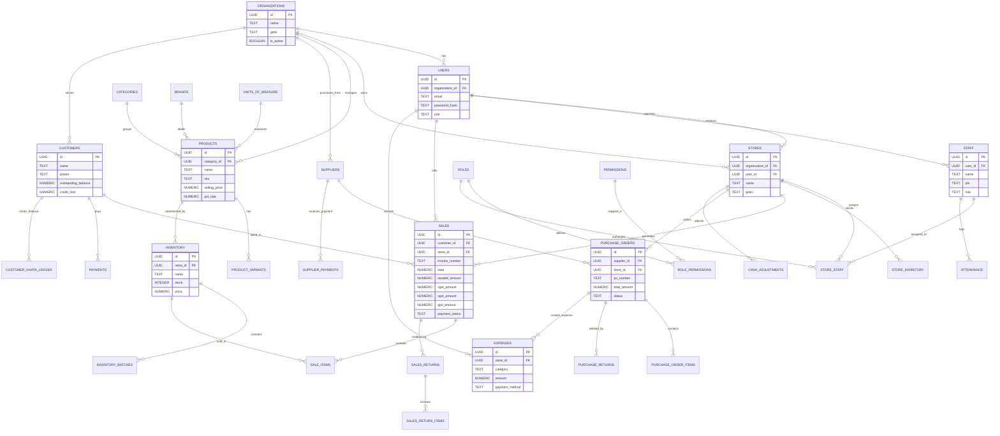

# KaroBar (कारोबार) Database Documentation & Migration Guide

Welcome to the definitive database reference and server migration guide for **KaroBar (FinSathi)**. This document contains everything required to deploy, migrate, configure, and maintain the PostgreSQL / Supabase database.

---

## 1. Architectural Overview

KaroBar uses **PostgreSQL 15+** (hosted natively or via **Supabase**) as its authoritative multi-tenant database.

### Key Tenets
1. **Multi-Tenant Isolation:** Top-level tenancy is anchored by `organizations` and `users`. All child records carry either `organization_id` or `user_id` (and where relevant, `store_id` for multi-store setups).
2. **Fast POS & Multi-Store Inventory:** Inventory operates with a high-speed direct lookup table (`inventory`) synchronized with batch-level inventory (`inventory_batches`) and multi-store balances (`store_inventory`).
3. **Double-Entry Khata & Cashbook:** Customer credit (Khata) and operating expenses maintain strict ledger integrity with atomic balance adjustments and concurrency guards (Optimistic Concurrency Control).
4. **GST Statutory Compliance:** POS billing records compute intra-state (`cgst_amount` + `sgst_amount`) and inter-state (`igst_amount`) components automatically for instant GSTR-1 and GSTR-3B report generation.

---

## 2. Server Connection Configuration

The backend accesses the database through two complementary connection channels:
1. **Direct PostgreSQL Connection Pool (`pg`):** Used for atomic transactions, OCC retries, and high-throughput POS operations.
2. **Supabase REST / PostgREST Client:** Used for standard CRUD and service-role operations.

### Required Environment Variables (`backend/.env`)

```env
# 1. Native PostgreSQL Pool Connection (Supabase Transaction Pooler or Direct Postgres)
DATABASE_URL=postgresql://postgres:[YOUR-PASSWORD]@[YOUR-DB-HOST]:5432/postgres?sslmode=require

# 2. Supabase API Credentials
SUPABASE_URL=https://[YOUR-PROJECT-REF].supabase.co
SUPABASE_KEY=[YOUR-SUPABASE-SERVICE-ROLE-KEY]

# 3. Environment & Security
NODE_ENV=production
JWT_SECRET=[YOUR-STRONG-RANDOM-SECRET-KEY]
ALLOWED_ORIGINS=http://localhost:5173,https://yourdomain.com
```

> **Note on Supabase Pooler:** In production or serverless deployments, always use port `6543` (Transaction Pooler) or `5432` with connection pooling to prevent exhausting Postgres connection limits.

---

## 3. How to Shift to a New Database Server (Step-by-Step)

If you are shifting KaroBar to a fresh PostgreSQL server or a new Supabase project, follow this sequence:

### Step 1: Provision the Empty Database
Create a clean PostgreSQL database (version 15 or higher).
- On **Supabase**: Simply create a new project.
- On **Self-Hosted PostgreSQL / Docker**:
  ```bash
  createdb -U postgres -h localhost karobar
  ```

### Step 2: Choose Your Migration Method

#### Option A: One-Click Instant Master Schema (Recommended)
We provide a consolidated master schema file: [`database/schema_final.sql`](schema_final.sql).

- **Via psql CLI:**
  ```bash
  psql -U postgres -h [YOUR-DB-HOST] -d postgres -f database/schema_final.sql
  ```
- **Via Supabase Dashboard:**
  1. Open your Supabase Dashboard.
  2. Navigate to **SQL Editor** -> **New Query**.
  3. Paste the entire contents of `database/schema_final.sql`.
  4. Click **Run** (Ctrl + Enter).

#### Option B: Step-by-Step Canonical Migrations
If you prefer running modular migrations or use a migration runner (Flyway, Liquibase, db-migrate), run the scripts inside [`database/canonical_migrations/`](canonical_migrations/) in strict numerical order:

| Sequence | File Name | Domain / Purpose |
| :---: | :--- | :--- |
| **01** | `01_extensions_and_identity.sql` | `pgcrypto`, `uuid-ossp`, `organizations`, `users`, `stores`, `admin_users` |
| **02** | `02_staff_and_rbac.sql` | `roles`, `permissions`, `role_permissions`, `staff`, `store_staff`, `attendance` |
| **03** | `03_catalog_and_masters.sql` | `uom_groups`, `units_of_measure`, `categories`, `brands`, `products`, `variants` |
| **04** | `04_inventory_and_stock.sql` | `inventory`, `store_inventory`, `inventory_batches`, `stock_movements` |
| **05** | `05_customers_and_khata.sql` | `customers`, `payments`, `customer_khata_ledger` |
| **06** | `06_pos_and_sales.sql` | `sales`, `sale_items`, `sales_returns`, `sales_return_items` |
| **07** | `07_purchases_and_suppliers.sql` | `suppliers`, `purchase_orders`, `purchase_order_items`, `purchase_returns`, `supplier_payments` |
| **08** | `08_expenses_and_cashbook.sql` | `expense_categories`, `expenses`, `cash_adjustments` |
| **09** | `09_audit_notifications_views_triggers.sql` | `notifications`, `audit_logs`, `dashboard_kpis_view`, triggers, and indexes |
| **10** | `10_seed_defaults.sql` | Default system roles (`Owner`, `Manager`, `Cashier`), permissions, GST rates, RLS disabled |

Execute via command line:
```bash
for file in database/canonical_migrations/*.sql; do
    psql "$DATABASE_URL" -f "$file"
done
```

---

### Step 3: Seed Demo / Initial Data (Optional)

To populate the new database with demo stores, products, suppliers, customers, and test sales:
```bash
cd backend
npm run seed:demo
```
Default demo accounts will be created with standard password: `Karobar@12345`.

---

### Step 4: Verify Deployment Health

Run this SQL query to verify all primary tables and views are active:
```sql
SELECT table_name 
FROM information_schema.tables 
WHERE table_schema = 'public' 
ORDER BY table_name;
```

You should see 38 core tables plus `dashboard_kpis_view`.

To verify the materialized view refresh function:
```sql
SELECT refresh_dashboard_kpis();
```

---

## 4. Entity-Relationship (ER) Diagram

The following Mermaid diagram visualizes the primary tables and their relationships across the 8 functional domains:



---

## 5. Directory Structure

```text
database/
├── README.md                      # This definitive documentation and migration guide
├── schema_final.sql               # Authoritative master schema (1-click full install)
├── canonical_migrations/          # Clean, structured sequential migrations (01 to 10)
│   ├── 01_extensions_and_identity.sql
│   ├── 02_staff_and_rbac.sql
│   ├── 03_catalog_and_masters.sql
│   ├── 04_inventory_and_stock.sql
│   ├── 05_customers_and_khata.sql
│   ├── 06_pos_and_sales.sql
│   ├── 07_purchases_and_suppliers.sql
│   ├── 08_expenses_and_cashbook.sql
│   ├── 09_audit_notifications_views_triggers.sql
│   └── 10_seed_defaults.sql
└── migrations/                    # Legacy historical migration archive (preserved for audit)
```

---

## 6. Legacy Migrations Notice (Quarantine)
The `database/migrations/` directory contains historical draft migration files (numbered `01` through `66`) used during iterative development. 

> **Important:** When deploying to a new database server, **do NOT run the historical draft files in `database/migrations/`**. Always execute [`database/schema_final.sql`](schema_final.sql) or the files in [`database/canonical_migrations/`](canonical_migrations/). The legacy folder is kept strictly as a historical commit trail.
