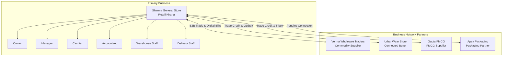

# KaroBar (कारोबार) — Demo Credentials & Environment Reference

This document serves as the official reference for all pre-seeded demo accounts, test credentials, multi-tenant organizations, and role-based test scenarios in the KaroBar application.

---

## 🔐 Universal Demo Password

All demo accounts share the standard password:

```text
Karobar@12345
```

---

## 👥 Demo User Accounts & Role Directory

| Role | Email | Organization | Context & Capabilities |
| :--- | :--- | :--- | :--- |
| **Owner (Kirana)** | `demo.owner@karobar.test` | **Sharma General Store** | **Full Admin / Owner Access**: Business Command Center, Financial Health Audit, P&L, Business Network, Settings. |
| **Manager** | `demo.manager@karobar.test` | **Sharma General Store** | **Store Operations**: Staff management, attendance logs, shift scheduling, inventory adjustments. |
| **Cashier** | `demo.cashier@karobar.test` | **Sharma General Store** | **Counter POS Terminal**: Rapid barcode billing, invoice history, customer khata lookup, shift clock-in. |
| **Accountant** | `demo.accountant@karobar.test` | **Sharma General Store** | **Financials & Compliance**: Sales ledger reconciliation, GST reports (GSTR-1, GSTR-3B), expense vouchers. |
| **Warehouse Staff** | `demo.inventory@karobar.test` | **Sharma General Store** | **Catalog & Warehouse**: Stock intake, batch & expiry management, purchase order receiving, low stock alerts. |
| **Delivery Staff** | `demo.delivery@karobar.test` | **Sharma General Store** | **Logistics & Dispatch**: Order fulfillment, delivery run tracking, customer drop-off verification. |
| **Wholesale Supplier** | `demo.wholesale@karobar.test` | **Verma Wholesale Traders** | **B2B Commodity Supplier**: Supplier Hub, B2B wholesale catalog, trade invoicing, purchase orders. |
| **Apparel Store** | `demo.apparel@karobar.test` | **UrbanWear Store** | **Connected Buyer**: KaroBar Business Network trading partner, digital invoice inbox/outbox. |
| **FMCG Distributor** | `demo.distributor@karobar.test` | **Gupta FMCG** | **Connected FMCG Supplier**: Trade credit lines (₹2.5L limit), digital bill sync, supplier reputation. |
| **Packaging Partner** | `demo.packaging@karobar.test` | **Apex Packaging** | **B2B Packaging Supplier**: Pending partner invite, trade credit agreements, supply orders. |

---

## 🏢 Multi-Tenant Organization Contexts

Each demo account belongs to an isolated organization with pre-populated business data:



---

## 🚀 Quick Testing Workflows by Role

### 1. Owner Workspace (`demo.owner@karobar.test`)
* **Dashboard**: View the complete Business Command Center, 8 snapshot KPIs, dynamic greeting, live clock, Recharts sales analytics, money flow, and AI recommendations.
* **Health Score**: Check `/health-score` for the 5-dimension audit (Sales, Cash Flow, Inventory, Collections, Profile).
* **Business Network**: Check `/network` for connected suppliers, digital trade bills, credit lines, and trust scores.

### 2. Cashier Counter POS (`demo.cashier@karobar.test`)
* **Billing**: Go to `/billing` to generate fast GST invoices with barcode search and cash/UPI/credit modes.
* **Attendance**: Click "Clock In Now" on the dashboard header to log shift attendance.
* **Invoices**: Audit customer invoices under `/invoice-history`.

### 3. Warehouse Staff (`demo.inventory@karobar.test`)
* **Catalog & Batches**: Visit `/inventory` to check FEFO/FIFO stock batches, low-stock alerts, and stock valuation.
* **Receiving**: Open `/suppliers` to receive purchase order shipments from suppliers.

### 4. Accountant Ledger (`demo.accountant@karobar.test`)
* **GST Reports**: Visit `/reports/gst` to review GSTR-1 and GSTR-3B tax breakdowns.
* **Expenses**: Log operational receipts under `/expenses`.
* **Receivables**: Follow up on customer credit under `/customers`.

---

## ⚡ 1-Click Login

You can log into any of these accounts with **a single click** from the [KaroBar Login Screen (`/login`)](http://localhost:5173/login) using the **Demo Credentials Hub** card on the right-hand panel.

---

## 🔄 Re-seeding Demo Data

To reset the database and restore all demo accounts and transactions to their initial state, run the backend seed script:

```bash
node backend/src/database/seed/demoSeed.js
```
