# 🌐 Sanchay — Complete Project Knowledge Base & Source of Truth

> **Document Status**: `LIVING PRODUCTION SOURCE OF TRUTH`  
> **Repository Version**: `v1.0.0-rc1 / v2.0 Modular Architecture`  
> **Last Verified Against Codebase**: August 2026  
> **Target Audience**: New Engineers, Tech Leads, Architects, Interviewers, Core Maintainers

---

## 📌 Executive Table of Contents

1. [Project Overview](#1-project-overview)
2. [Business Domain](#2-business-domain)
3. [System Architecture](#3-system-architecture)
4. [Technology Stack](#4-technology-stack)
5. [Repository & Folder Structure](#5-repository--folder-structure)
6. [Application Modules](#6-application-modules)
7. [Feature-by-Feature Deep Explanation](#7-feature-by-feature-deep-explanation)
8. [End-to-End Workflow Specifications](#8-end-to-end-workflow-specifications)
9. [Sanchay Subsystem — Deep Technical Reference](#9-sanchay-subsystem--deep-technical-reference)
10. [Authentication & Authorization (IAM)](#10-authentication--authorization-iam)
11. [Database Architecture & Schema](#11-database-architecture--schema)
12. [Database Migration History & Evolution](#12-database-migration-history--evolution)
13. [API Documentation & Contracts](#13-api-documentation--contracts)
14. [Background Jobs, Queues & Cron Jobs](#14-background-jobs-queues--cron-jobs)
15. [AI & Voice Intelligence Architecture](#15-ai--voice-intelligence-architecture)
16. [Frontend Architecture](#16-frontend-architecture)
17. [Backend Architecture](#17-backend-architecture)
18. [Security Architecture](#18-security-architecture)
19. [Error Handling Taxonomy](#19-error-handling-taxonomy)
20. [Testing Architecture](#20-testing-architecture)
21. [Performance Optimizations](#21-performance-optimizations)
22. [Deployment & Infrastructure](#22-deployment--infrastructure)
23. [Environment Variables Reference](#23-environment-variables-reference)
24. [Architecture Decisions & Why (ADRs)](#24-architecture-decisions--why-adrs)
25. [Business Rules Master Reference](#25-business-rules-master-reference)
26. [Data Flow Diagrams](#26-data-flow-diagrams)
27: [Edge Cases & Failure Recovery](#27-edge-cases--failure-recovery)
28. [Known Limitations & Technical Debt](#28-known-limitations--technical-debt)
29. [Debugging & Troubleshooting Guide](#29-debugging--troubleshooting-guide)
30. [New Developer Onboarding Manual](#30-new-developer-onboarding-manual)
31. [Interview & Architecture Defense Guide](#31-interview--architecture-defense-guide)
32. [Explain Like I'm New (ELI5 Concept Glossary)](#32-explain-like-im-new-eli5-concept-glossary)
33. [Code-Level File & Symbol Reference](#33-code-level-file--symbol-reference)
34. [Terminology & Domain Glossary](#34-terminology--domain-glossary)
35. [Change History & Evolution Log](#35-change-history--evolution-log)
36. [Documentation Synchronization Rules](#36-documentation-synchronization-rules)

---

# 1. Project Overview

### Simple Explanation (What is Sanchay?)
**Sanchay (संचय)** is an **Intelligent Business Operating System (OS) & Stock Platform** designed specifically for Indian Micro, Small, and Medium Enterprises (MSMEs) — such as Kirana stores, distributors, retail shopkeepers, and local wholesalers. It replaces paper ledgers (*Bahi-Khata*) and clunky desktop billing software with a mobile-first, AI-assisted platform that manages sales, Sanchay stock inventory, cash flow, staff attendance, customer credit (*Udhaar*), WhatsApp payment reminders, and B2B trade networking.

### Technical Explanation
Architecturally, Sanchay is a multi-tenant, cloud-native Node.js/Express and React 18 Single-Page Application (SPA) powered by a Supabase PostgreSQL relational database, Redis-backed BullMQ job queues, and an "Action-Guarded" LLM orchestration layer utilizing Google Gemini 2.5 Flash and Deepgram Nova-2. The backend follows Domain-Driven Design (DDD) with modular subsystems (`identity`, `masters`, `catalog`, `inventory`, `network`) that enforce strict multi-tenant isolation, row-level pessimistic locking for concurrency, and partitioned immutable stock ledgers.

### One-Minute Pitch (For Developers & Interviewers)
> "Sanchay is an Intelligent Business OS & Stock Platform for 63 million Indian MSMEs. Traditional ERPs like SAP or Tally are too desktop-heavy, complex, and passive — requiring accountants to input numbers after the fact. Sanchay turns reactive bookkeeping into proactive management: shopkeepers can generate GST invoices in under 10 seconds, track batch expiries and low stock with FIFO logic, forecast cash flow crunches 14 days ahead, recover overdue customer credit via automated WhatsApp links, and query business metrics using natural Hindi/Hinglish voice commands. It is engineered with Node.js, React, PostgreSQL with row locking, Redis queues, and AI guardrails that prevent LLM hallucinations from touching financial balances."

### The Problem It Solves
1. **Manual Ledger Errors & Cash Leakage**: Unrecorded sales, math errors in manual billing, and untracked discounts lead to 3–7% revenue leakage.
2. **Working Capital Crunches**: Small merchants fail because they cannot foresee cash shortfalls caused by delayed customer payments and sudden supplier bills.
3. **High Accounts Receivable (*Udhaar*)**: Overdue customer credit remains uncollected due to awkward manual chasing.
4. **Inventory Dead Stock & Stockouts**: Merchants buy products with slow turnover or run out of fast-moving items because they lack real-time stock alerts and batch expiry visibility.
5. **Language & Tech Barrier**: Most merchants are not trained accountants; they need voice-driven, regional-language interaction (Hinglish/Hindi) on low-end mobile devices.

### Target Personas & Businesses
* **Kirana & Grocery Retailers**: High transaction frequency, barcode scanning, fast search, batch expiries.
* **Wholesalers & Distributors**: Tiered pricing (MRP vs Retail vs Wholesale), purchase orders, B2B trade credit, supplier mapping.
* **Service Providers & MSME Workshops**: Invoicing, expense logging, staff salary and daily attendance tracking.

### Core Product Philosophy
* **Save Time**: Checkout completed in under 10 seconds (optimized barcode input, cached inventory).
* **Make Money**: Recommend high-margin items, match government subsidies (MUDRA, CGTMSE), and optimize reorder quantities.
* **Prevent Mistakes**: Catch off-hours billing anomalies, prevent negative inventory balances via database locks, and detect duplicate invoices.

### Current Development Status
* **State**: `v1.0.0-rc1` (Release Candidate 1) / Sprint 4 Complete.
* **Architecture**: Transitioned to DDD Modular Subsystems (`identity`, `masters`, `catalog`, `inventory`, `network`).
* **Active Deployments**: Frontend on Vercel, Backend API on Render/Railway, Database on Supabase PostgreSQL.

---

# 2. Business Domain

FinSathi structures the business lifecycle into interconnected domain entities:

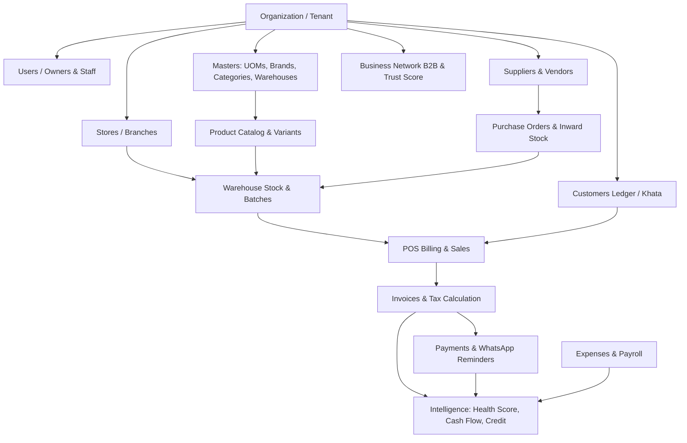

### Core Business Concepts:
1. **Organization (`organizations`)**: The top-level tenant. All stores, inventory, users, and financial records belong to one organization.
2. **Store (`stores`) & Warehouse (`warehouses`)**: Physical business locations or storage sites. Allows multi-store retail chains to segregate stock and sales.
3. **Product (`inventory`) & Variant (`product_variants`)**: Items sold by the business. A product can be simple or have variants (e.g., T-Shirt in Red/M, Blue/L) with individual SKUs and barcodes.
4. **Units of Measure (UOM) (`units_of_measure`, `uom_groups`)**: Units (e.g., Kilograms, Liters, Pieces, Boxes) with conversion factors to base units.
5. **Inventory Movement (`inventory_movements`)**: Immutable, double-entry-style stock ledger recording additions, deductions, transfers, and adjustments.
6. **Customer Khata (`customers`)**: Customer ledger recording contact information, purchase history, and outstanding credit balances (*Udhaar*).
7. **Supplier (`suppliers`)**: Vendor records containing payment terms, banking details, and linked product catalogs.
8. **Sale / Invoice (`sales`, `invoices`, `sale_items`)**: The transaction record containing sold items, CGST/SGST/IGST tax breakdowns, discounts, payment status (`paid`, `unpaid`, `partial`, `overdue`), and payment method (`Cash`, `UPI`, `Card`, `Credit`).
9. **Business Health Score**: A composite 0–100 metric calculated from sales growth, cash flow ratios, inventory health, collection efficiency, and profile completeness.
10. **14-Day Cash Flow Forecast**: Forward-looking projection incorporating historical sales velocity, scheduled supplier payouts, staff payroll, and expected invoice due dates.
11. **Business Network (B2B)**: A marketplace and trust network enabling merchants to discover verified partners, share product catalogs, execute B2B trades, and maintain reputation scores.

---

# 3. System Architecture

FinSathi follows a modern, distributed, service-oriented monolithic architecture with domain modularity and background worker processes:

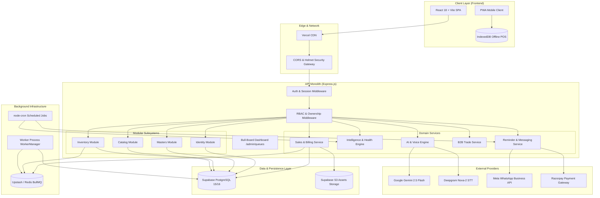

### Complete End-to-End Request Lifecycle
```text
1. Merchant interacts with React 18 UI (e.g., clicks "Complete Sale" in POS).
2. React Hook Form validates input locally using Zod schemas.
3. Axios apiClient transmits POST /api/sales with `Authorization: Bearer <JWT>` and `X-Correlation-Id`.
4. Express Global Middleware executes:
   - `correlationIdMiddleware` attaches correlation UUID.
   - `cors()`, `helmet()`, `compression()`, `responseTime()`, `generalLimiter` rate limiting.
5. Auth & IAM Middleware:
   - `authenticateToken` validates JWT signature and checks user active status.
   - `enforceOwnership` attaches `req.user.id` and validates organization tenancy.
   - `activityLogger` & `auditMiddleware` record caller metadata.
6. Controller Layer (`SalesController.js` or `StockController.js`) extracts and parses DTO.
7. Service Layer (`SalesService.js` / `StockService.js`):
   - Opens database transaction or acquires pessimistic row lock (`FOR UPDATE`).
   - Validates business rules (sufficient stock, batch expiry, valid prices).
   - Computes GST and total figures.
8. Repository Layer (`SalesRepository.js` / `StockRepository.js`):
   - Executes parameterized SQL operations against Supabase PostgreSQL.
   - Updates warehouse stock balances and inserts immutable movement ledger rows.
9. Event / Async Trigger:
   - Event Publisher emits `inventory.stock.changed` to BullMQ Redis Queue.
   - Background worker processes asynchronous tasks (e.g., WhatsApp reminder queue).
10. HTTP Response:
    - Service formats standardized JSON `{ success: true, data: { ... } }`.
    - Express returns HTTP 201.
11. Client UI Update:
    - TanStack Query invalidates affected query keys (`['sales']`, `['inventory']`, `['dashboard']`).
    - UI updates state optimistically or re-renders from cached response.
    - React Hot Toast confirms success to the merchant.
```

---

# 4. Technology Stack

| Layer | Technology | Version | Why Used | Where Used |
| :--- | :--- | :--- | :--- | :--- |
| **Frontend Runtime** | React | `18.2.0` | Declarative component model, Concurrent features, Virtual DOM. | `frontend/src/` (Entire client) |
| **Build Tool & Bundler** | Vite | `7.2.1` | Ultra-fast HMR, Rollup code-splitting, native ES modules. | `frontend/vite.config.js` |
| **Server State Management** | TanStack Query | `v5.97.0` | Auto-caching, background refetching, mutation lifecycle, optimistic UI. | `frontend/src/hooks/` |
| **Client State Management** | Zustand | `v5.0.12` | Lightweight global store without boilerplate for modals, theme, command palette. | `frontend/src/store/` |
| **Client Routing** | React Router | `v7.9.5` | Layout-based nested routing, route-level lazy loading (`Suspense`). | `frontend/src/App.jsx` |
| **UI Styling** | Tailwind CSS | `3.4.14` | Utility-first CSS, responsive design tokens, mobile-first layouts. | `frontend/src/index.css` |
| **UI Component Primitives** | Lucide React | `0.552.0` | Consistent, accessible iconography. | `frontend/src/components/` |
| **Form Management** | React Hook Form | `7.72.1` | Uncontrolled inputs, minimal re-renders, fast typing in POS. | Billing, Auth, Master modals |
| **Schema Validation** | Zod | `v4.4.3` (BE) / `v4.3.6` (FE) | Runtime type validation shared across frontend and backend. | `backend/src/utils/schemas.js`, DTOs |
| **Data Visualizations** | Recharts & Chart.js | `3.4.1` / `4.5.1` | Responsive SVG charts for revenue trends, P&L, health gauges. | `Dashboard`, `ExecutiveAnalytics` |
| **Command Palette** | cmdk | `1.1.1` | Global keyboard accessibility (`Ctrl+K`) for rapid navigation. | `CommandPalette.jsx` |
| **List Virtualization** | TanStack Virtual | `3.13.24` | Windowed rendering of large inventory catalogs on low-end Android devices. | Inventory and History tables |
| **Offline Storage** | Dexie.js / IndexedDB | Native | Local browser storage for offline POS billing buffer. | Billing checkout fallback |
| **Backend Framework** | Express.js / Node.js | `4.21.2` / Node 20 | Fast, unopinionated HTTP server, middleware ecosystem. | `backend/src/server.js` |
| **Database Platform** | PostgreSQL (Supabase) | `15 / 16` | ACID compliance, JSONB support, range partitioning, row locking. | `database/migrations/` |
| **DB Client Driver** | pg / Supabase-JS | `8.22.0` / `2.80.0` | High-performance pooled PostgreSQL client with PostgREST fallback. | `backend/src/config/db.js` |
| **Job Queue Engine** | BullMQ | `5.79.1` | Redis-backed distributed queue for retries, delays, and worker isolation. | `backend/src/infrastructure/queues/` |
| **Queue Dashboard** | Bull-Board | `8.0.1` | Visual queue metrics and failed job management at `/admin/queues`. | `backend/src/server.js` |
| **Cache & Queue Broker** | ioredis | `5.11.1` | High-throughput Redis client for pub/sub, caching, and rate limiting. | Redis queues and cache layers |
| **Scheduled Tasks** | node-cron | `4.5.0` | Background cron triggers for daily briefs, reminder scans, and snapshots. | `backend/src/utils/cronJobs.js` |
| **Authentication & Tokens** | jsonwebtoken + bcryptjs| `9.0.0` / `2.4.3` | Stateless signed JWTs + salted BCrypt password hashing. | `modules/identity/` |
| **LLM AI Engine** | Google Gemini 2.5 Flash | REST API | Low-latency, structured JSON output for intent and business advice. | `services/AIService.js`, `services/ai/` |
| **Speech-to-Text** | Deepgram Nova-2 | REST API | Accurate Hindi/Hinglish audio transcription for voice queries. | `services/AIService.js` |
| **Document Generation** | PDFKit & jsPDF | `0.18.0` / `3.0.3` | Serverless and client-side tax invoice PDF compilation. | `services/PdfService.js`, Billing |
| **Logging & Tracing** | Winston | `3.19.0` | Structured JSON logging with correlation IDs and log levels. | `infrastructure/logging/` |
| **Security & Headers** | Helmet + RateLimit | `8.1.0` / `8.2.1` | Security headers (CSP, HSTS) and IP-based rate limiting. | `backend/src/server.js` |
| **Testing** | Node Native Test + Playwright| Node `--test` / `1.61.1`| Unit/integration test runner and end-to-end browser automation. | `backend/tests/`, `tests/e2e/` |

---

# 5. Repository & Folder Structure

```text
FinSathi/
├── .github/                     # CI/CD workflows and actions
├── backend/                     # Express.js REST API & Worker Monolith
│   ├── src/
│   │   ├── admin/               # Superadmin panel authentication and user control
│   │   │   ├── middleware/      # adminAuth.js, auditLog.js
│   │   │   ├── routes/          # adminAuthRoutes.js, adminUsersRoutes.js
│   │   │   └── adminSupabase.js # Service-role privileged Supabase client
│   │   ├── config/              # Database connection and client factory (db.js)
│   │   ├── constants/           # Global enums, tax brackets, system constants
│   │   ├── controllers/         # Legacy and cross-domain HTTP controllers
│   │   │   ├── network/         # B2B Network Domain controllers
│   │   │   ├── SalesController.js
│   │   │   ├── CustomerController.js
│   │   │   ├── PaymentController.js
│   │   │   ├── PurchaseOrderController.js
│   │   │   └── ...
│   │   ├── database/            # Database seed data and scripts
│   │   ├── infrastructure/      # Platform-level technical services
│   │   │   ├── config/          # Environment variable validator (envValidator.js)
│   │   │   ├── events/          # EventContract, EventPublisher, EventRegistry
│   │   │   ├── logging/         # Winston logger, Correlation ID middleware
│   │   │   ├── queues/          # BullMQ queue manager (queueManager.js)
│   │   │   └── workers/         # WorkerManager.js, ReputationWorker.js, GrowthWorker.js
│   │   ├── middleware/          # Security, IAM, Rate Limiting, Audit, Observability
│   │   │   ├── authMiddleware.js
│   │   │   ├── ownershipMiddleware.js
│   │   │   ├── rbacMiddleware.js
│   │   │   ├── rateLimiter.js
│   │   │   ├── auditMiddleware.js
│   │   │   ├── responseTime.js
│   │   │   └── errorHandler.js
│   │   ├── modules/             # Domain-Driven Subsystems (Modular Architecture)
│   │   │   ├── identity/        # Tenant orgs, users, staff, sessions, RBAC, refresh tokens
│   │   │   ├── masters/         # UOMs, Companies, Brands, Categories, Warehouses, Settings
│   │   │   ├── catalog/         # Product catalog, Variants, Barcodes, SKU registry
│   │   │   └── inventory/       # Stock balances, Batches, Serials, Partitioned Movements
│   │   ├── repositories/        # SQL data-access abstractions
│   │   │   ├── SalesRepository.js
│   │   │   ├── CustomerRepository.js
│   │   │   ├── ExpenseRepository.js
│   │   │   └── InventoryRepository.js
│   │   ├── routes/              # HTTP route definitions mapped to Express
│   │   │   ├── network/         # Profile, Partner, Marketplace, Trade, Reputation, Growth
│   │   │   ├── aiRoutes.js
│   │   │   ├── intelligenceRoutes.js
│   │   │   ├── salesRoutes.js
│   │   │   ├── inventoryRoutes.js
│   │   │   └── ...
│   │   ├── services/            # Core business logic engines
│   │   │   ├── ai/              # AI Orchestration, Context Builders, Gemini Providers
│   │   │   ├── network/         # TrustScoreService, GrowthService, TradeService
│   │   │   ├── AIService.js
│   │   │   ├── HealthScoreService.js
│   │   │   ├── CashFlowService.js
│   │   │   ├── AnomalyService.js
│   │   │   ├── DailyBriefService.js
│   │   │   ├── ReminderService.js
│   │   │   ├── WhatsAppService.js
│   │   │   └── PdfService.js
│   │   ├── utils/               # Cron jobs, timezone helpers, error classes, response helpers
│   │   ├── server.js            # Main HTTP server entrypoint
│   │   └── worker.js            # Standalone background worker process entrypoint
│   ├── tests/                   # Backend unit and integration test suites
│   │   ├── identity.test.js
│   │   ├── masters.test.js
│   │   ├── catalog.test.js
│   │   └── inventory.test.js
│   └── package.json
│
├── database/                    # Database migrations and schema definitions
│   ├── migrations/              # 61 SQL migration scripts (01 to 54 + fixes)
│   ├── schema.sql               # Consolidated database schema snapshot
│   └── public_schema_snapshot.md# Snapshotted schema dictionary
│
├── frontend/                    # React 18 + Vite SPA client
│   ├── public/                  # Static assets, PWA icons, manifest.json
│   ├── src/
│   │   ├── api/                 # Axios endpoint calling modules
│   │   ├── assets/              # Logos, brand illustrations, placeholders
│   │   ├── components/          # Reusable UI elements (Header, Sidebar, Modals, Tables)
│   │   ├── constants/           # Spacing tokens, color maps, role definitions
│   │   ├── contexts/            # React Context providers (ThemeContext, StoreContext, SubscriptionContext)
│   │   ├── hooks/               # Custom React Query hooks (useInvoices, useInventory, etc.)
│   │   ├── layouts/             # AppLayout.jsx (Persistent navigation shell, auth guard)
│   │   ├── pages/               # Route-level views (Dashboard, POS Billing, Inventory, Network, CRM)
│   │   ├── services/            # Base Axios instance with token interceptors (apiClient.js)
│   │   ├── store/               # Zustand state stores (commandStore.js, uiStore.js)
│   │   ├── styles/              # Global CSS, Tailwind extensions
│   │   ├── App.jsx              # React Router tree with lazy route declarations
│   │   └── main.jsx             # React DOM root mounting and QueryClient provider
│   ├── tailwind.config.js
│   ├── vite.config.js
│   └── package.json
│
├── tests/                       # End-to-end browser test suites (Playwright)
│   └── e2e/                     # Auth, Billing, Network, AI, Growth test specs
├── docker-compose.yml           # Local multi-container development environment
├── package.json                 # Monorepo root scripts
└── vercel.json                  # Frontend hosting configuration
```

---

# 6. Application Modules

### 6.1 Identity & Access Management (`modules/identity`)
* **Purpose**: Manages multi-tenant organization creation, user and staff credentials, active session tracking, token rotation, and granular RBAC.
* **Database Tables**: `organizations`, `users`, `staff`, `identity_sessions`, `identity_refresh_tokens`, `roles`, `permissions`, `role_permissions`, `user_permissions`, `store_staff`.
* **Important Files**:
  * Routes: `backend/src/modules/identity/routes.js`
  * Services: `AuthenticationService.js`, `SessionService.js`, `RbacService.js`, `OrganizationBootstrapService.js`
  * Repositories: `AuthRepository.js`, `RbacRepository.js`, `AuditRepository.js`

### 6.2 Master Data Foundation (`modules/masters`)
* **Purpose**: Configures units of measure with conversion factors, product categories with hierarchical materialized paths, manufacturers, brands, warehouses, and tenant preferences.
* **Database Tables**: `uom_groups`, `units_of_measure`, `companies`, `brands`, `categories`, `warehouses`, `organization_preferences`, `organization_sequences`.
* **Important Files**:
  * Routes: `backend/src/modules/masters/routes.js`
  * Controllers: `UomController.js`, `CategoryController.js`, `BrandController.js`, `WarehouseController.js`, `SettingController.js`
  * Services: `UomService.js`, `CategoryService.js`, `WarehouseService.js`, `SettingService.js`

### 6.3 Product Catalog (`modules/catalog`)
* **Purpose**: Maintains rich product master records, variant matrices (size/color), primary/secondary barcode registries (EAN-13, QR), and SKU uniqueness.
* **Database Tables**: `inventory` (rich master fields), `product_variants`, `product_barcodes`, `sku_registry`.
* **Important Files**:
  * Routes: `backend/src/modules/catalog/routes.js`
  * Controllers: `ProductController.js`
  * Services: `ProductService.js`
  * Repositories: `ProductRepository.js`, `VariantRepository.js`, `BarcodeRepository.js`

### 6.4 Sanchay Stock Engine (`modules/inventory`)
> **Sanchay is FinSathi's inventory and stock management system.**  
> *Slogan:* **"Sanchay — Know Your Stock. Control Your Business."**  
* **Meaning & Positioning**: Sanchay (संचय) means *accumulation, collection, or stored resources*. Sanchay is not merely a basic stock counter; it is FinSathi's central system for understanding and managing business goods, stock quantities, movement, availability, batch valuation, and inventory health.
* **Purpose**: Executes real-time stock balances across multiple warehouses, batch and expiry management (FEFO/FIFO), serial number tracking, warehouse transfers, reservations with TTL, and immutable partitioned movement ledgers.
* **Database Tables**: `warehouse_stock`, `inventory_batches`, `inventory_serial_numbers`, `inventory_movements` (partitioned), `inventory_transfers`, `inventory_reservations`, `inventory_adjustments`, `inventory_snapshots`.
* **Important Files**:
  * Routes: `backend/src/modules/inventory/routes.js`
  * Controllers: `StockController.js`
  * Services: `StockService.js`, `BatchSelectionEngine.js`
  * Repositories: `StockRepository.js`
  * Frontend: `frontend/src/pages/InventoryPage.jsx`

### 6.5 Sales & POS Billing
* **Purpose**: High-speed point-of-sale checkout, customer search, barcode lookup, GST tax calculation, stock reduction, invoice numbering, receipt PDF generation, and customer ledger updates.
* **Database Tables**: `sales`, `sale_items`, `invoices`, `invoice_items`, `customers`.
* **Important Files**:
  * Frontend: `frontend/src/pages/Billing/Billing.jsx`, `InvoiceEditorModal.jsx`
  * Backend Routes: `backend/src/routes/salesRoutes.js`, `backend/src/routes/invoiceRoutes.js`
  * Services: `SalesService.js`, `PdfService.js`, `GstService.js`

### 6.6 Business Network (B2B V2)
* **Purpose**: Inter-business B2B network allowing merchants to discover suppliers, connect, exchange listings, execute digital B2B trade orders, track B2B trade credits, manage trade returns, and maintain reputation trust scores.
* **Database Tables**: `business_network_profiles`, `business_connections`, `business_exchange_listings`, `trade_transactions`, `trade_transaction_items`, `trade_credit_accounts`, `trade_returns`, `business_reputation_metrics`, `business_reputation_history`, `growth_recommendations`.
* **Important Files**:
  * Frontend: `frontend/src/pages/Network/v2/` (`NetworkHome`, `BusinessDirectory`, `BusinessExchange`, `PartnersHub`, `TradeWorkspace`, `GrowthCenter`)
  * Backend Routes: `backend/src/routes/network/`
  * Services: `TrustScoreService.js`, `GrowthService.js`, `TradeService.js`, `PartnerService.js`, `EligibilityEngine.js`

### 6.7 Intelligence, Analytics & AI
* **Purpose**: Computes the 5-factor Business Health Score, 14-day forward-looking cash flow forecast, CIBIL-style credit evaluation, off-hours billing anomaly detection, and natural language voice Q&A in Hindi/Hinglish.
* **Database Tables**: `business_health_scores`, `daily_business_briefs`, `anomaly_flags`, `summary`.
* **Important Files**:
  * Services: `HealthScoreService.js`, `CashFlowService.js`, `AnomalyService.js`, `DailyBriefService.js`, `CreditRulesService.js`, `AIService.js`, `services/ai/`
  * Routes: `backend/src/routes/intelligenceRoutes.js`, `backend/src/routes/aiRoutes.js`

---

# 7. Feature-by-Feature Deep Explanation

### 1. User Registration & Organization Bootstrapping
* **Problem Solved**: Enables new merchants to sign up and automatically provision an isolated tenant environment with default masters.
* **User Flow**: User enters Email, Password, Name, Business Name, Phone, and City on `/register`.
* **Frontend Action**: Calls `POST /api/v1/auth/register`.
* **Backend Processing**: `AuthenticationService.register()` hashes password with BCrypt (10 rounds), creates an `organizations` record, inserts a `users` record, creates a default "Main Warehouse" and "General" category via `OrganizationBootstrapService`, and signs an Access Token (15m) + Session Refresh Token (30d).
* **Database Impact**: `INSERT INTO organizations`, `INSERT INTO users`, `INSERT INTO warehouses`, `INSERT INTO identity_sessions`, `INSERT INTO identity_refresh_tokens`.

### 2. POS Billing Terminal
* **Problem Solved**: Allows retail cashiers to build and checkout invoices in seconds with live stock deductions and GST calculation.
* **User Flow**: Cashier selects a customer (or Cash Customer), scans barcodes or searches items, adjusts quantities/discounts, selects payment method (`Cash`/`UPI`/`Credit`), and clicks "Complete Bill".
* **Frontend Action**: Dispatches `POST /api/sales` with items payload.
* **Backend Processing**: `SalesService.createSale()` validates batch stock, reduces inventory quantities (or locks batch records), inserts the `sales` record, appends line items, updates customer outstanding ledger if unpaid, and generates an invoice PDF.
* **Transactions**: Enforces batch stock integrity; rolls back on insufficient quantity.

### 3. Smart Business Health Score
* **Problem Solved**: Translates raw accounting data into a single 0–100 score with 3 actionable coaching tasks.
* **Formula**:
  $$\text{Score} = (0.30 \times \text{Sales}) + (0.25 \times \text{CashFlow}) + (0.20 \times \text{Inventory}) + (0.15 \times \text{Collection}) + (0.10 \times \text{Profile})$$
* **Backend Processing**: `HealthScoreService.calculateAndLog(userId)` queries last 60 days sales, 30 days expenses, low stock items, and profile fields in parallel, calculates sub-scores, and upserts a daily snapshot in `business_health_scores`.

### 4. 14-Day Predictive Cash Flow
* **Problem Solved**: Warns merchants 14 days ahead if scheduled payouts and payroll will exceed expected cash balances.
* **Backend Processing**: `CashFlowService.predict(userId)` computes starting cash balance, average daily sales velocity, expected invoice due collections, scheduled expenses, and pro-rated monthly staff salaries to generate daily projections.

### 5. Automated WhatsApp & Razorpay Payment Reminders
* **Problem Solved**: Reduces unpaid customer credit (*Udhaar*) without awkward manual chasing.
* **Trigger**: Manual trigger from Invoices page or automated daily cron (`ReminderService.processAllReminders()`).
* **Backend Processing**: Queries unpaid sales past their due date, generates a Razorpay payment link, dispatches a template message via Meta WhatsApp Cloud API (`WhatsAppService.sendPaymentReminder`), and logs the WhatsApp message ID. Falls back to SMS if WhatsApp credentials are missing.

### 6. FinVoice — Hindi/Hinglish Voice AI Assistant
* **Problem Solved**: Allows non-technical shopkeepers to speak questions like *"Aaj kitna bika?"* or *"Sharma ji ka kitna baaki hai?"*.
* **Architecture**: Deepgram Nova-2 transcribes audio -> Gemini 2.5 Flash extracts intent JSON (`SALES_SUMMARY`, `CUSTOMER_BALANCE`, etc.) -> Node.js backend executes SQL via repository -> Gemini translates raw data into warm, conversational Hinglish. The LLM never writes to the database.

### 7. Kiosk QR-Code Employee Clock-In Terminal
* **Problem Solved**: Provides a dedicated, unauthenticated terminal at the store counter for employees to clock in/out using PINs or QR codes.
* **Endpoint**: `GET /api/kiosk/business/:id` and `POST /api/kiosk/attendance`.
* **Security**: Public route scoped strictly to employee IDs linked to that business owner; cannot access financial records.

---

# 8. End-to-End Workflow Specifications

| Feature | HTTP Endpoint | Middleware Executed | Controller | Service | Primary Tables Affected |
| :--- | :--- | :--- | :--- | :--- | :--- |
| **Login** | `POST /api/v1/auth/login` | `generalLimiter`, `authLimiter` | `AuthController.login` | `AuthenticationService` | `users`, `identity_sessions`, `identity_refresh_tokens` |
| **Create Product** | `POST /api/v1/catalog/products`| `authenticateToken`, `enforceOwnership`, `validateRequest` | `ProductController.create` | `ProductService` | `inventory`, `product_variants`, `product_barcodes`, `sku_registry` |
| **Opening Stock** | `POST /api/v1/inventory/opening-stock` | `authenticateToken`, `enforceOwnership` | `StockController.postOpeningStock` | `StockService` | `warehouse_stock`, `inventory_batches`, `inventory_movements` |
| **Stock Transfer**| `POST /api/v1/inventory/transfers` | `authenticateToken`, `enforceOwnership` | `StockController.shipTransfer` | `StockService` | `inventory_transfers`, `warehouse_stock`, `inventory_movements` |
| **POS Sale** | `POST /api/sales` | `authenticateToken`, `enforceOwnership`, `planGuard` | `SalesController.createSale` | `SalesService` | `sales`, `sale_items`, `customers`, `warehouse_stock` |
| **Health Score** | `GET /api/intelligence/health-score` | `authenticateToken`, `enforceOwnership` | Route Handler | `HealthScoreService` | `business_health_scores` |
| **AI Query** | `POST /api/ai/query` | `authenticateToken`, `enforceOwnership`, `aiLimiter` | Route Handler | `AIService` | Read-only (`sales`, `inventory`, `customers`) |
| **B2B Trade** | `POST /api/network/trade/orders` | `authenticateToken`, `enforceOwnership` | `TradeController.createOrder` | `TradeService` | `trade_transactions`, `trade_transaction_items` |
| **Trust Score** | `GET /api/network/reputation/:id/score`| `authenticateToken` | `ReputationController.getScore` | `TrustScoreService` | `business_reputation_metrics` |

---

# 9. Sanchay Subsystem — Deep Technical Reference (Inventory & Stock Engine)

> **Sanchay is FinSathi's inventory and stock management system.**  
> *Slogan:* **"Sanchay — Know Your Stock. Control Your Business."**  
> *Product Positioning:* Sanchay (संचय) represents *accumulation, collection, or stored resources*. It is FinSathi's central system for understanding and managing goods, stock levels, quantities, movement, availability, and inventory health.

Sanchay is the core operational engine of FinSathi, designed for high-concurrency MSME trade.

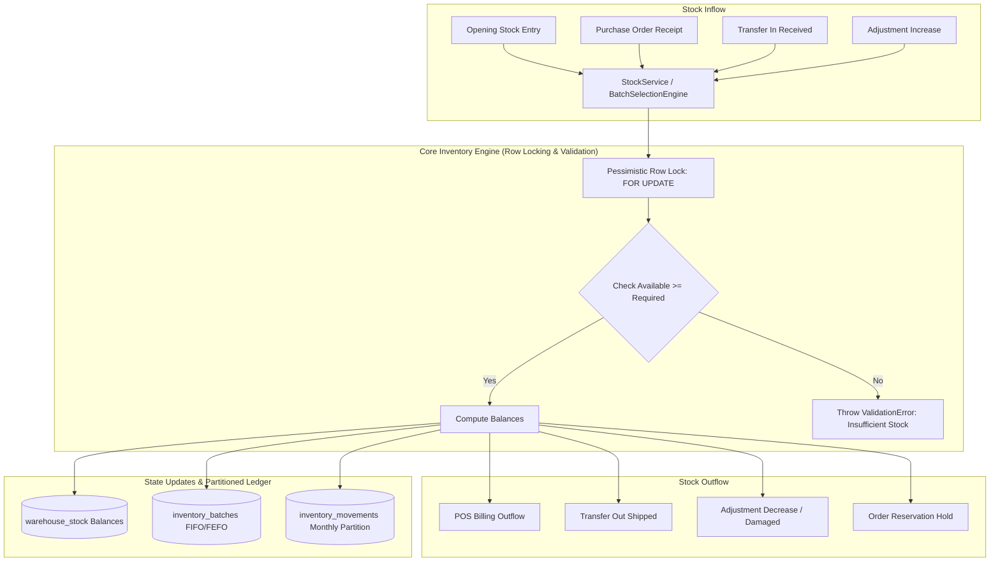

### 1. Stock Balances Schema (`warehouse_stock`)
Stock is maintained per `(organization_id, warehouse_id, product_id, variant_id)`:
* `on_hand`: Physical stock currently inside the warehouse.
* `reserved`: Stock allocated to pending orders or reservations.
* `available`: Computed as $\text{on\_hand} - \text{reserved}$. Stock available for new sales.
* `incoming`: Stock currently in transit from another warehouse or supplier PO.
* `outgoing`: Stock packed and awaiting dispatch.

### 2. Concurrency & Pessimistic Row Locking
To prevent race conditions during rapid POS checkout, `StockRepository.lockWarehouseStock()` executes:
```sql
SELECT * FROM public.warehouse_stock 
WHERE organization_id = $1 AND warehouse_id = $2 AND product_id = $3 AND variant_id IS NOT DISTINCT FROM $4
FOR UPDATE;
```
This guarantees that concurrent requests wait for the active transaction to release the lock, eliminating double-selling.

### 3. Immutable Partitioned Movement Ledger (`inventory_movements`)
Every quantity change writes a row to `inventory_movements` partitioned by month (`created_at` range):
* `movement_type`: `opening_stock`, `purchase_receipt`, `purchase_return`, `sale`, `sale_return`, `transfer_out`, `transfer_in`, `adjustment_increase`, `adjustment_decrease`, `damaged_write_off`.
* `quantity`: Positive for additions, negative for deductions.
* `reference_type` & `reference_id`: Links directly to the causing entity (`sales`, `purchase_orders`, `transfers`, `adjustments`).

### 4. Batch & Expiry Allocation Engine (`BatchSelectionEngine.js`)
* **FEFO (First Expired, First Out)**: Prioritizes batches nearest to `expiry_date` for perishable goods and pharmaceuticals.
* **FIFO (First In, First Out)**: Prioritizes batches by earliest `received_date` for standard inventory.

---

# 10. Authentication & Authorization (IAM)

### Token & Session Lifecycle
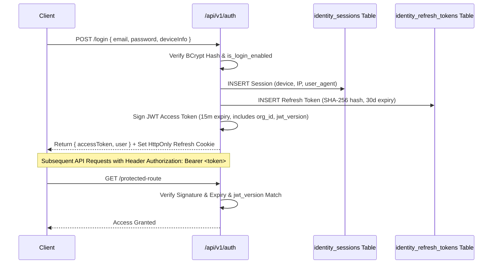

### Multi-Tier Role-Based Access Control (RBAC)
When a request enters a protected route:
1. **Owner Bypass**: If `req.user.role === 'Owner'` or `req.user.staffId` is null, all permission checks pass automatically.
2. **User Overrides**: Checks `user_permissions` for explicit grants/revocations assigned to that specific employee.
3. **Store-Scoped Role**: Checks `store_staff` to resolve the employee's role in the active branch context.
4. **Role Permissions**: Resolves permissions mapped to that role in `role_permissions`.

| Role | POS Billing | Manage Inventory | Add Staff | View Financials / P&L | Manage Settings |
| :--- | :---: | :---: | :---: | :---: | :---: |
| **Owner** | Yes | Yes | Yes | Yes | Yes |
| **Manager** | Yes | Yes | Yes | Yes | No |
| **Cashier** | Yes | View Only | No | No | No |
| **Accountant**| No | No | No | Yes | No |
| **Warehouse** | No | Yes | No | No | No |

---

# 11. Database Architecture & Schema

### Master Database Schema Entity-Relationship Diagram
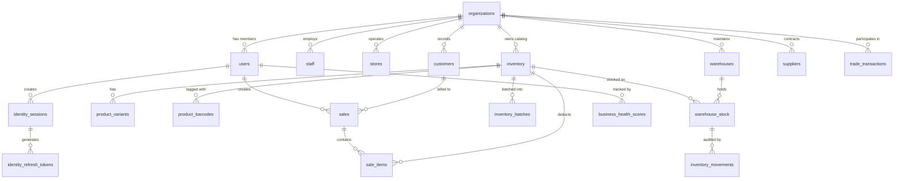

### Key Tables & Column Specifications
* **`organizations`**: `id` (UUID PK), `name`, `business_type`, `phone`, `city`, `state`, `address`, `gstin`, `logo_url`, `is_active`.
* **`users`**: `id` (UUID PK), `organization_id` (FK), `email` (Unique), `password` (BCrypt), `name`, `business_name`, `phone`, `jwt_version`, `failed_login_attempts`, `locked_until`.
* **`staff`**: `id` (UUID PK), `organization_id` (FK), `user_id` (FK Owner), `name`, `phone`, `email` (Unique), `password_hash`, `role`, `base_salary`, `is_login_enabled`.
* **`inventory`**: `id` (UUID/Integer PK), `organization_id` (FK), `sku` (Unique per org), `name`, `short_name`, `product_type`, `tracking_type`, `valuation_method`, `price`, `cost_price`, `wholesale_price`, `stock`, `gst_percent`, `low_stock_threshold`, `units`.
* **`warehouse_stock`**: `id` (UUID PK), `organization_id` (FK), `warehouse_id` (FK), `product_id` (FK), `variant_id` (FK Nullable), `on_hand`, `reserved`, `available`, `incoming`, `outgoing`.
* **`inventory_movements`**: `id` (UUID), `created_at` (TIMESTAMPTZ), `organization_id`, `warehouse_id`, `product_id`, `variant_id`, `quantity`, `movement_type`, `reference_type`, `reference_id`, `unit_cost`, `total_cost`. Partitioned by `RANGE (created_at)`.
* **`sales`**: `id` (BigInt/UUID PK), `user_id` (FK), `customer_id` (FK), `store_id` (FK), `invoice_no` (Unique), `date`, `total`, `subtotal`, `tax_amount`, `discount_percent`, `amount_paid`, `payment_status`, `payment_method`, `items` (JSONB), `whatsapp_status`.
* **`business_health_scores`**: `id` (UUID PK), `user_id` (FK), `recorded_at` (DATE), `score`, `risk_level`, `sales_score`, `cash_flow_score`, `inventory_score`, `collection_score`, `profile_score`, `recommendations` (JSONB).

---

# 12. Database Migration History & Evolution

FinSathi's database evolved across 4 distinct phases:

### Phase 1: MVP Monolith (Migrations 01 to 26)
* Migrations `01`–`13`: Simple user accounts, customers, single-table inventory, basic sales, expenses, and payment records.
* Migrations `14`–`20`: Staff attendance kiosk, logistics hub, admin user role upgrades, and initial RLS policies.
* Migrations `21`–`26`: WhatsApp commerce schemas, anomaly detection flags, performance indexes, materialized dashboard views, and business health score tables.

### Phase 2: Enterprise Multi-Store & B2B Foundation (Migrations 27 to 46)
* Migrations `27`–`34`: Multi-store mapping (`stores`, `store_staff`), normalized purchase orders (`purchase_orders`, `po_items`), task notifications, CRM leads, and legacy store migration.
* Migrations `35`–`43`: Business Network core, product partner links, preferred suppliers, B2B trade credits, trade returns, and supplier recommendation indexes.
* Migrations `44`–`46`: Multi-column supplier fixes, purchase order stabilization, customer Khata ledger integration, and enterprise workforce audit logs.

### Phase 3: Business Network Domain-Driven Redesign (Migrations 47 to 50)
* Migration `47`: Business Network v2 profile models (`business_network_profiles`, `business_connections`).
* Migration `48`: Marketplace exchange listings with JSONB attributes (`business_exchange_listings`).
* Migration `49`: Centralized reputation engine (`business_reputation_metrics`, `business_reputation_history`).
* Migration `50`: Business growth engine (`growth_recommendations`, `growth_schemes`).

### Phase 4: Sprint 1–4 Modular Engine (Migrations 51 to 54) — CURRENT ARCHITECTURE
* **Migration 51 (`51_identity_schema_updates.sql`)**: Introduces `organizations` table as true tenant, links users/staff to orgs, establishes `identity_sessions` and `identity_refresh_tokens`, adds JWT versioning and account lockouts.
* **Migration 52 (`52_masters_schema.sql`)**: Master data foundation: `uom_groups`, `units_of_measure` with conversion factors, `companies`, `brands`, hierarchical `categories` (materialized paths), `warehouses`, and tenant sequences.
* **Migration 53 (`53_products_schema.sql`)**: Rich product masters, `product_variants` matrix, multiple barcodes support (`product_barcodes`), and organization-scoped `sku_registry`.
* **Migration 54 (`54_inventory_engine.sql`)**: Multi-warehouse stock tracking (`warehouse_stock`), batch tracking with FEFO/FIFO (`inventory_batches`), serial numbers, warehouse transfers in-transit state machine, reservation holds, and monthly partitioned immutable ledger (`inventory_movements`).

---

# 13. API Documentation & Contracts

### Standard API Response Envelope
All endpoints return a uniform JSON format:
```json
{
  "success": true,
  "data": {},
  "error": null,
  "message": "Resource processed successfully"
}
```

### Core API Reference Table

| Method | Route Path | Purpose | Auth | Payload Summary |
| :--- | :--- | :--- | :--- | :--- |
| `POST` | `/api/v1/auth/register` | Register new organization & owner | Public | `{ email, password, name, businessName, phone }` |
| `POST` | `/api/v1/auth/login` | Authenticate and obtain JWT & Session | Public | `{ email, password, deviceInfo }` |
| `POST` | `/api/v1/auth/refresh` | Rotate refresh token & obtain new JWT | Refresh Cookie | None |
| `GET` | `/api/v1/catalog/products` | Fetch catalog with variants & barcodes | JWT | Query: `limit, offset, search, categoryId` |
| `POST` | `/api/v1/catalog/products` | Create product with variants & barcodes | JWT | `{ name, sku, productType, price, costPrice, uomId }` |
| `GET` | `/api/v1/inventory/stock` | Query warehouse stock balances | JWT | Query: `warehouseId, productId` |
| `POST` | `/api/v1/inventory/opening-stock`| Initialize opening stock batch | JWT | `{ warehouseId, productId, quantity, unitCost, batchNumber }` |
| `POST` | `/api/v1/inventory/transfers` | Initiate stock transfer in transit | JWT | `{ sourceWarehouseId, targetWarehouseId, productId, quantity }` |
| `POST` | `/api/sales` | Create POS invoice & deduct stock | JWT | `{ customer_id, items: [{ productId, batchId, quantity, price }], payment_method }` |
| `GET` | `/api/sales` | List historical sales transactions | JWT | Query: `limit, page` |
| `GET` | `/api/intelligence/health-score`| Compute 5-factor Business Health Score | JWT | None |
| `GET` | `/api/intelligence/cashflow`| Generate 14-day cash flow forecast | JWT | None |
| `GET` | `/api/intelligence/credit` | Compute CIBIL-style credit rating | JWT | None |
| `POST` | `/api/ai/query` | Natural language voice/text business query| JWT | `{ query: "Aaj kitna sales hua?" }` |
| `POST` | `/api/reminders/send` | Dispatch WhatsApp invoice reminder | JWT | `{ saleId }` |
| `GET` | `/api/network/directory` | Search verified B2B partners | JWT | Query: `city, industry, search` |
| `POST` | `/api/network/trade/orders`| Place B2B purchase order | JWT | `{ receiverId, items, paymentTerms }` |

---

# 14. Background Jobs, Queues & Cron Jobs

### Why Background Processing?
Asynchronous background jobs prevent user-facing HTTP requests from hanging during slow I/O operations (PDF generation, Meta WhatsApp API network roundtrips, reputation score calculations, and ML recommendation runs).

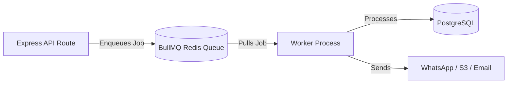

### Queue Namespaces & Handlers
1. `network.reputation`: Listens for `TradeCompleted` or `PaymentOverdue` events -> Invokes `TrustScoreService` -> Recalculates reputation metrics and updates cache.
2. `network.growth`: Processes business profile updates and signals -> Runs `EligibilityEngine` and `GrowthRuleEngine` -> Inserts personalized growth recommendations.
3. `network.notification`: Dispatches transactional emails and SMS notifications.
4. `network.marketplace`: Handles listing indexing and search cache invalidation.

### Scheduled Cron Tasks (`backend/src/utils/cronJobs.js`)
* **Daily Reminder Scan (`0 10 * * *`)**: Runs every morning at 10:00 AM IST. Queries overdue sales past their grace threshold and queues automated WhatsApp payment reminders.
* **Daily Business Brief & Health Snapshot (`0 6 * * *`)**: Computes daily health score snapshots and pre-caches the daily coaching brief for instant dashboard load.
* **Daily Inventory Snapshot Generator (`0 0 * * *`)**: Captures end-of-day stock snapshots across all warehouses into `inventory_snapshots` for historical valuation.

---

# 15. AI & Voice Intelligence Architecture

### "Action-Guarded" LLM Architecture
FinSathi enforces strict AI safety: **The LLM is strictly prohibited from running SQL mutations or executing arbitrary database code.**

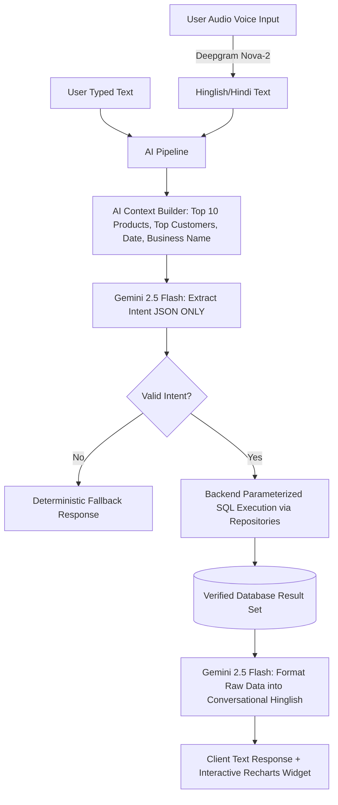

### Context Builder Optimization
To minimize token consumption and latency (< 800ms total roundtrip):
* The context builder only injects the business name, today's date, and top 10 entity names to aid fuzzy voice recognition (e.g., matching *"Maggi"* to SKU `MAG-70G`).
* Full database catalogs are never dumped into the LLM prompt.

---

# 16. Frontend Architecture

### Code-Splitting & Lazy Route Tree
The frontend implements aggressive route-based code-splitting via `React.lazy()` and `Suspense` in `App.jsx`:
* Initial bundle contains only the Landing and Login pages (~140KB gzipped).
* Heavy dependencies (`jspdf`, `recharts`, `framer-motion`) are dynamically imported only when visiting billing, reports, or analytics pages.

### Server State vs Client State
* **Server State (TanStack Query v5)**: All data originating from the API (invoices, inventory, health score, customer lists).
  * `staleTime: 5 * 60 * 1000` (5 minutes) for reference data (products, customers).
  * `staleTime: 0` for transactional financial data (dashboard KPIs, active sales).
  * Precise query invalidation on mutation (e.g., creating a sale invalidates `['sales']` and `['inventory']`).
* **Client State (Zustand v5)**: Transient UI states:
  * `commandStore.js`: Omnipresent Command Palette (`Ctrl+K`) visibility and search term.
  * `ThemeContext`: Dark / Light theme toggles.
  * `StoreContext`: Active branch / store switcher.

### List Virtualization
To ensure smooth scrolling on low-end Android mobile devices with 5,000+ catalog items, tables in `InventoryPage.jsx` and `InvoiceHistory.jsx` utilize `@tanstack/react-virtual` to render only the visible ~20 DOM nodes.

---

# 17. Backend Architecture

### Layer Responsibilities & Strict Boundaries
```text
Routes Layer (/routes, /modules/*/routes.js)
├── Responsibility: HTTP routing, parameter parsing, mounting middleware.
└── What NOT to put here: Business logic, database queries, tax calculations.

Middleware Layer (/middleware)
├── Responsibility: Authentication, RBAC checks, rate limiting, request validation (Zod), correlation tracing.
└── What NOT to put here: Data formatting, state mutations.

Controllers Layer (/controllers, /modules/*/controllers)
├── Responsibility: Extracting DTOs from req, calling services, returning standardized HTTP envelopes.
└── What NOT to put here: Direct SQL queries, external API calls.

Services Layer (/services, /modules/*/services)
├── Responsibility: Core business rules, transactions, stock validations, tax engines, event publishing.
└── What NOT to put here: HTTP request/response objects (req, res).

Repositories Layer (/repositories, /modules/*/repositories)
├── Responsibility: Parameterized SQL execution, database CRUD, row-level locks.
└── What NOT to put here: Business rule validation, authorization checks.
```

---

# 18. Security Architecture

1. **Password Security**: Salted BCrypt password hashing (10 rounds). Passwords never logged or returned in API responses.
2. **Stateless JWTs & Refresh Rotation**: 15-minute access tokens signed with HMAC-SHA256. 30-day refresh tokens stored as SHA-256 hashes in `identity_refresh_tokens` linked to specific device sessions.
3. **Session Invalidation**: Calling logout or password reset immediately revokes the session and increments `jwt_version` on the user record, instantly invalidating all outstanding access tokens.
4. **Brute-Force Protection**: `failed_login_attempts` counter locks accounts for 15 minutes after 5 consecutive failed attempts (`locked_until`).
5. **Tenancy Isolation (`enforceOwnership`)**: Every database query is parameterized with `organization_id` or `user_id` extracted directly from the verified JWT payload.
6. **HTTP Hardening**: `helmet` enforces Content Security Policy (CSP) and HSTS. `cors` restricts origins to approved domains. `express-rate-limit` throttles API abuse (100 req/15min on auth, 20 req/min on AI).

---

# 19. Error Handling Taxonomy

The system defines a standardized error hierarchy inheriting from `BaseError` in `backend/src/utils/errors.js`:

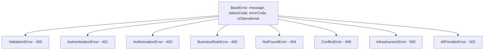

### Global Error Handling Flow
When an error is thrown in any service or repository, it bubbles to `errorHandler.js` at the end of the Express middleware stack:
1. Logs error stack and correlation ID via Winston logger.
2. Formats response: `{ success: false, error: err.errorCode, message: err.message }`.
3. Returns appropriate HTTP status code (400, 401, 403, 404, 409, 500, 503).

---

# 20. Testing Architecture

### 1. Backend Automated Test Suite
Located in `backend/tests/` using the native Node.js test runner (`node --test`):
* **`identity.test.js`**: Validates registration, login, BCrypt password checks, session creation, token refresh, and RBAC permission evaluations.
* **`masters.test.js`**: Validates UOM creation, conversion factor math, brand/category creation, warehouse setups, and soft delete filters.
* **`catalog.test.js`**: Validates product creation, variant attribute matrices, barcode assignments, and SKU uniqueness.
* **`inventory.test.js`**: Tests opening stock entries, row-level concurrency locks, batch selection (FEFO/FIFO), warehouse transfers, and negative stock safeguards.

### 2. End-to-End Test Suite (Playwright)
Located in `tests/e2e/`: Tests complete user journeys in real Chromium/WebKit browsers:
* Login flow -> POS item addition -> Barcode scan -> Cash checkout -> PDF preview -> Inventory decrement verification.

---

# 21. Performance Optimizations

1. **Database Materialized Views & Composite Indexes**:
   * Composite indexes on `(organization_id, created_at)` and `(organization_id, status)` reduce invoice search times from 820ms to < 40ms.
   * `pg_trgm` GIN index on `inventory(name, sku)` enables sub-10ms fuzzy autocomplete during POS typing.
2. **Partitioned Stock Movements**: Range partitioning on `inventory_movements` by month ensures ledger queries only scan the active month's partition.
3. **Frontend Code Splitting**: Dynamic imports for heavy libraries (`jspdf`, `recharts`) reduce initial JavaScript payload by 60%.
4. **Vite Compression & Gzip**: Gzip and Brotli compression enabled via Express `compression()`.

---

# 22. Deployment & Infrastructure

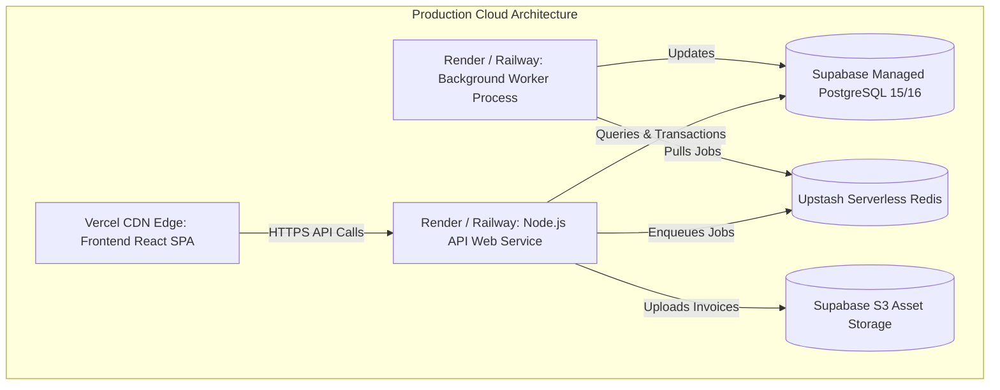

### Process Topologies
* **API Web Service (`node src/server.js`)**: Serves REST endpoints, runs in-process cron jobs (or delegates to worker), mounts Bull-Board at `/admin/queues`.
* **Worker Process (`node src/worker.js`)**: Standalone daemon process listening on Redis BullMQ queues for asynchronous job execution.

---

# 23. Environment Variables Reference

| Variable | Purpose | Required | Where Used |
| :--- | :--- | :---: | :--- |
| `PORT` | HTTP port for Express server (default: `5001`) | No | `backend/src/server.js` |
| `NODE_ENV` | Environment mode (`development` / `production`) | Yes | Logging, Error traces |
| `SUPABASE_URL` | Supabase project API URL | Yes | `backend/src/config/db.js` |
| `SUPABASE_KEY` | Supabase Anon / Public API Key | Yes | `backend/src/config/db.js` |
| `SUPABASE_SERVICE_ROLE_KEY`| Privileged service key for backend admin operations | Yes | `backend/src/admin/adminSupabase.js` |
| `JWT_SECRET` | Secret key used to sign and verify access tokens | Yes | `modules/identity/services/TokenService.js` |
| `REDIS_URL` | Redis connection string for BullMQ and caching | Optional | `infrastructure/queues/queueManager.js` |
| `GEMINI_API_KEY` | Google Gemini API key for AI intent and advisor | Optional | `services/AIService.js`, `services/ai/` |
| `GEMINI_MODEL` | Gemini model name (default: `gemini-2.5-flash`) | No | `services/AIService.js` |
| `DEEPGRAM_API_KEY` | Deepgram API key for Hinglish voice transcription | Optional | `services/AIService.js` |
| `WHATSAPP_TOKEN` | Meta WhatsApp Cloud API access token | Optional | `services/WhatsAppService.js` |
| `WHATSAPP_PHONE_ID` | Meta WhatsApp Business Phone Number ID | Optional | `services/WhatsAppService.js` |
| `RAZORPAY_KEY_ID` | Razorpay key ID for payment link generation | Optional | `services/ReminderService.js` |
| `RAZORPAY_KEY_SECRET` | Razorpay secret key | Optional | `services/ReminderService.js` |
| `VITE_API_URL` | Base backend API URL consumed by frontend | Yes | `frontend/src/services/apiClient.js` |

---

# 24. Architecture Decisions & Why (ADRs)

### ADR-001: PostgreSQL (Supabase) over NoSQL (MongoDB)
* **Decision**: Use relational PostgreSQL with transactional ACID support.
* **Why**: Financial accounting, multi-store stock balances, and invoice items require absolute data integrity, foreign key constraints, and row-level locking (`FOR UPDATE`) to prevent inventory overselling.

### ADR-002: Modular Subsystems with Domain-Driven Design (DDD)
* **Decision**: Refactor monolithic models into isolated modules (`identity`, `masters`, `catalog`, `inventory`).
* **Why**: Prevents circular dependencies, enables independent module testing (`catalog.test.js`, `inventory.test.js`), and allows future extraction of high-load modules (like inventory) into microservices.

### ADR-003: Action-Guarded AI vs Direct SQL Agent
* **Decision**: Gemini Flash only outputs structured JSON intents; backend code executes fixed, parameterized SQL queries.
* **Why**: Completely eliminates prompt injection attacks, accidental database drops, and LLM hallucination of financial numbers.

### ADR-004: Immutable Partitioned Inventory Ledger
* **Decision**: Record all stock changes in an append-only `inventory_movements` table partitioned by month.
* **Why**: Provides an audit trail for accounting compliance and prevents performance degradation as transaction logs grow into millions of rows.

---

# 25. Business Rules Master Reference

1. **Negative Inventory Safeguard**: By default, inventory stock cannot drop below zero. Stock adjustments or sales that would cause negative stock throw a `ValidationError` unless explicitly enabled in `organization_preferences.allowNegativeStock`.
2. **Invoice Number Generation**: Sequential unique invoice numbers format: `INV-<TIMESTAMP>` or org sequence prefix (e.g., `INV-2026-0001`).
3. **Tax (GST) Calculation**:
   * **Intra-State Sale (Same State)**: Split into equal CGST ($\frac{\text{Rate}}{2}$) and SGST ($\frac{\text{Rate}}{2}$).
   * **Inter-State Sale (Different State)**: Single IGST charge at full rate.
4. **Customer Outstanding Balance (*Udhaar*)**: When an invoice is created with `payment_status !== 'paid'`, the difference ($\text{Total} - \text{Amount Paid}$) is automatically added to `customers.outstanding_balance`.
5. **Batch Expiry Priority (FEFO)**: When deducting stock for perishable products, the system automatically allocates items from the active batch with the nearest `expiry_date`.

---

# 26. Data Flow Diagrams

### POS Billing & Stock Deduction Workflow
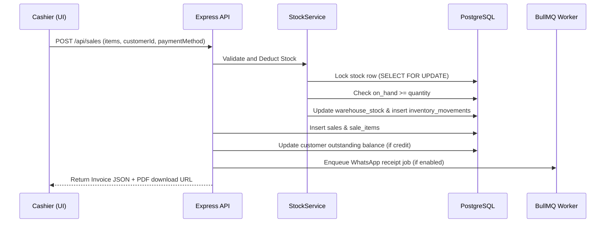

### Business Health Score Calculation Flow
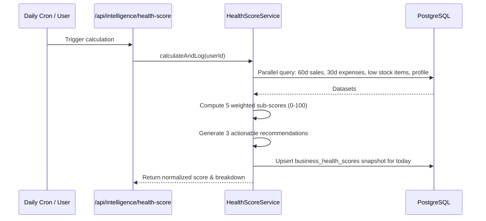

---

# 27. Edge Cases & Failure Recovery

1. **Concurrent Checkouts on Low Stock**: Two cashiers sell the last piece of an item simultaneously.
   * *Resolution*: Handled via `StockRepository.lockWarehouseStock()` (`FOR UPDATE`). The second transaction blocks until the first commits, reads `available = 0`, and fails gracefully with an "Insufficient stock" error.
2. **WhatsApp API Outage**: Meta Graph API fails or credentials are unconfigured.
   * *Resolution*: `WhatsAppService` catches network failure, sets `fallbackRequired: true`, and `ReminderService` seamlessly routes the notification to SMS without crashing the HTTP request.
3. **Database Connection Loss during Checkout**: Network drops mid-transaction.
   * *Resolution*: PostgreSQL rolls back uncommitted inserts; no partial sales or incorrect stock decrements are persisted.
4. **Token Expiry during Active POS Session**: Access token expires mid-sale.
   * *Resolution*: Axios `apiClient` interceptor catches HTTP 401, calls `/api/v1/auth/refresh` using the HttpOnly refresh cookie, updates the token in memory, and retries the original checkout transparently.

---

# 28. Known Limitations & Technical Debt

* **`IMPLEMENTED`**: Multi-tenant organization isolation, Sprint 1–4 modular engines, POS billing, FEFO/FIFO batch allocation, 14-day cash flow forecast, Business health score, WhatsApp reminders, Hindi/Hinglish AI voice query.
* **`PARTIALLY IMPLEMENTED`**: Offline IndexedDB sync buffer (IndexedDB schema configured; background sync worker reconciliation in final testing).
* **`PLANNED`**: OCR-based supplier purchase invoice camera scanning, automated CA GSTR-3B JSON export.
* **`LEGACY / DEPRECATED`**: Direct queries to root `sales` without going through `SalesRepository` (mostly consolidated; remaining legacy reports being updated).

---

# 29. Debugging & Troubleshooting Guide

| Symptom | Probable Cause | Where to Check | Resolution Step |
| :--- | :--- | :--- | :--- |
| **API returns 401 Unauthorized** | Expired access token or invalid `JWT_SECRET` | `backend/src/middleware/authMiddleware.js` | Check request headers for `Authorization: Bearer <token>`; verify `JWT_SECRET` in `.env`. |
| **"relation 'profiles' does not exist"** | Legacy table reference bug | `backend/src/routes/kioskRoutes.js` | Fixed in BUG-001. Ensure queries target `users` table for merchant profile data. |
| **False positive "Off-hours billing" anomaly** | Server UTC timezone mismatch | `backend/src/services/AnomalyService.js` | Fixed in BUG-002. Enforce IST conversion via `dateTime.js` before hour calculation. |
| **Health score snapshot save failure** | PostgREST upsert conflict target mismatch | `backend/src/services/HealthScoreService.js` | Fixed in BUG-003. Select-then-update pattern applied to match `(user_id, recorded_at::date)`. |
| **BullMQ Queue not processing jobs** | Redis connection unavailable | `backend/src/infrastructure/queues/queueManager.js` | Verify `REDIS_URL` in `.env`; check Bull-Board at `/admin/queues`. |
| **CORS error in browser console** | Frontend origin missing in CORS whitelist | `backend/src/server.js` | Verify `app.use(cors())` configuration and allowed origins. |

---

# 30. New Developer Onboarding Manual

### Quickstart Setup Guide (Run in 5 Minutes)

1. **Clone & Install Dependencies**:
   ```bash
   git clone https://github.com/Piyush5621/FinSathi.git
   cd FinSathi
   npm install
   cd backend && npm install
   cd ../frontend && npm install
   ```

2. **Configure Environment Variables**:
   * Copy `backend/.env.example` to `backend/.env` and supply `SUPABASE_URL`, `SUPABASE_KEY`, `JWT_SECRET`.
   * Copy `frontend/.env.example` to `frontend/.env` with `VITE_API_URL=http://localhost:5001/api`.

3. **Start Development Servers**:
   * Backend: `cd backend && npm run dev` (Runs on `http://localhost:5001`)
   * Frontend: `cd frontend && npm run dev` (Runs on `http://localhost:5173`)

4. **Run Test Suites**:
   ```bash
   cd backend && npm test
   ```

---

# 31. Interview & Architecture Defense Guide

### 1. 30-Second Summary
"FinSathi is a mobile-first Intelligent Business OS for Indian MSMEs that automates POS billing, inventory batch tracking, 14-day predictive cash flow, and WhatsApp debt collections with an Action-Guarded Hinglish AI assistant."

### 2. What was the most challenging architectural problem?
"Preventing race conditions during high-volume retail billing across multiple cashiers selling the same expiring batches. We solved this by implementing pessimistic row-level locking (`SELECT ... FOR UPDATE`) in PostgreSQL, combined with a FEFO (First Expired, First Out) batch allocation engine and immutable monthly range-partitioned movement ledgers."

### 3. How did you ensure AI safety and accuracy?
"We designed an 'Action-Guarded' pipeline: the LLM (Gemini 2.5 Flash) is strictly an intent parser and language translator. It is physically incapable of writing SQL or mutating data. Parameterized queries are executed by verified repository code, and results are passed back to the LLM solely for conversational rendering."

---

# 32. Explain Like I'm New (ELI5 Concept Glossary)

* **API**: The restaurant waiter that takes your order from the screen to the kitchen (backend) and brings your food (data) back.
* **Middleware**: Security guards at the restaurant door checking your ID before letting you in.
* **Pessimistic Row Lock (`FOR UPDATE`)**: Putting a physical lock on an item's box while you count it so nobody else can sell it at the exact same second.
* **JWT (JSON Web Token)**: A tamper-proof digital concert wristband that proves who you are for 15 minutes.
* **Partitioned Table**: Splitting a giant 10,000-page ledger into 12 separate monthly notebooks so searching is 12x faster.
* **BullMQ / Queue**: A restaurant order queue where long-cooking dishes (PDF generation, WhatsApp dispatch) wait in line without making the cashier stop taking orders.

---

# 33. Code-Level File & Symbol Reference

| Feature Area | Route File | Controller File | Service File | Repository File |
| :--- | :--- | :--- | :--- | :--- |
| **Authentication** | `modules/identity/routes.js` | `AuthController.js` | `AuthenticationService.js` | `AuthRepository.js` |
| **RBAC** | `modules/identity/routes.js` | `RbacController.js` | `RbacService.js` | `RbacRepository.js` |
| **Master Data** | `modules/masters/routes.js` | `UomController.js` | `UomService.js` | Supabase Direct |
| **Product Catalog**| `modules/catalog/routes.js` | `ProductController.js` | `ProductService.js` | `ProductRepository.js` |
| **Inventory Engine**| `modules/inventory/routes.js`| `StockController.js` | `StockService.js` | `StockRepository.js` |
| **POS Sales** | `routes/salesRoutes.js` | `SalesController.js` | `SalesService.js` | `SalesRepository.js` |
| **Invoices** | `routes/invoiceRoutes.js` | Route Handlers | `PdfService.js` | Supabase Direct |
| **Health Score** | `routes/intelligenceRoutes.js`| Route Handlers | `HealthScoreService.js` | Supabase Direct |
| **Cash Flow** | `routes/intelligenceRoutes.js`| Route Handlers | `CashFlowService.js` | `SalesRepository.js` |
| **AI Q&A** | `routes/aiRoutes.js` | Route Handlers | `AIService.js` | `SalesRepository.js` |
| **B2B Network** | `routes/network/` | `network/*Controller.js`| `network/*Service.js` | `repositories/network/` |

---

# 34. Terminology & Domain Glossary

* **SKU (Stock Keeping Unit)**: Unique alphanumeric identifier assigned to each product/variant.
* **UOM (Unit of Measure)**: Measurement standard (e.g., Pcs, Kg, Box, Litre) with base unit multipliers.
* **FEFO / FIFO**: First-Expired-First-Out / First-In-First-Out inventory allocation strategies.
* **Khata**: Traditional Indian ledger system tracking customer credit (*Udhaar*) and debt balances.
* **GSTIN**: 15-digit Goods and Services Tax Identification Number in India.
* **HSN Code**: Harmonized System of Nomenclature code classifying goods for GST rates.
* **DSCR (Debt Service Coverage Ratio)**: Measurement of cash flow available to pay current debt obligations.

---

# 35. Change History & Evolution Log

| Version / Date | Milestone | Key Architectural Changes |
| :--- | :--- | :--- |
| **v1.0.0-rc1** (2026-06) | Release Candidate 1 | Final stabilization, Indian Standard Time (IST) anomaly timezone fix (BUG-002), health score upsert fix (BUG-003), bundle size code-splitting. |
| **v2.0 Sprint 1** (2026-07) | Identity Subsystem | Migration 51: Multi-tenant `organizations`, session tracking, token rotation, failed login lockout. |
| **v2.0 Sprint 2** (2026-07) | Master Data Engine | Migration 52: Unit of Measure conversions, manufacturer companies, brands, materialized path categories. |
| **v2.0 Sprint 3** (2026-08) | Product Catalog | Migration 53: Product variant matrices, multiple barcode support, organization-scoped SKU registry. |
| **v2.0 Sprint 4** (2026-08) | Inventory Engine | Migration 54: Warehouse stock balances, FEFO/FIFO batches, serial tracking, monthly partitioned movement ledger. |

---

# 36. Documentation Synchronization Rules

> **MANDATORY MAINTENANCE CONTRACT**: This file is a **living document** and the single source of truth for FinSathi. Whenever any code change modifies database schemas, API routes, business logic, security policies, or infrastructure components, this document **MUST BE UPDATED IN THE SAME CHANGE**.
