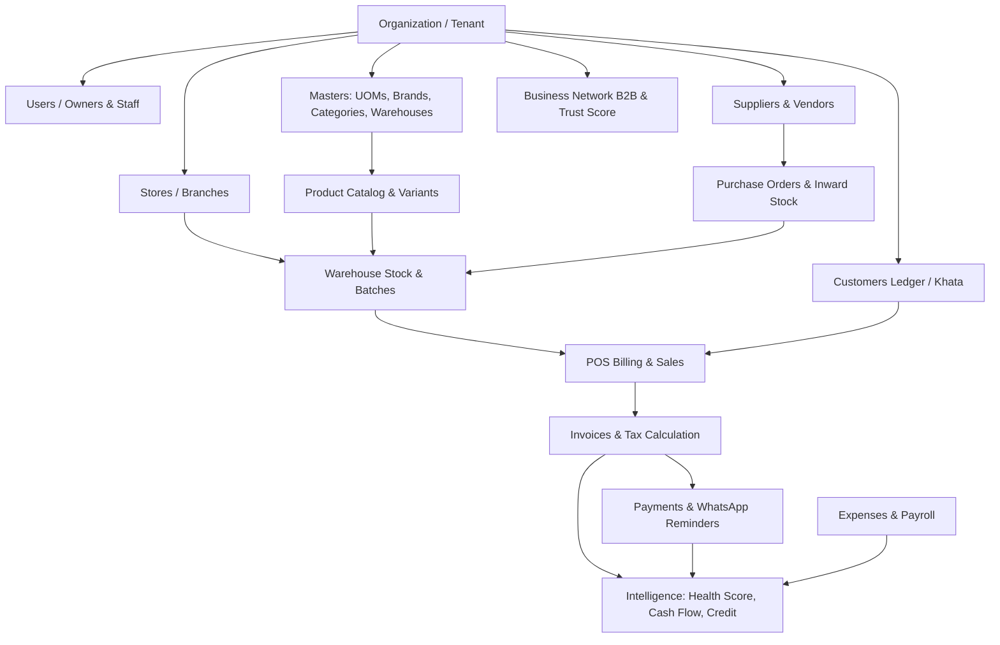
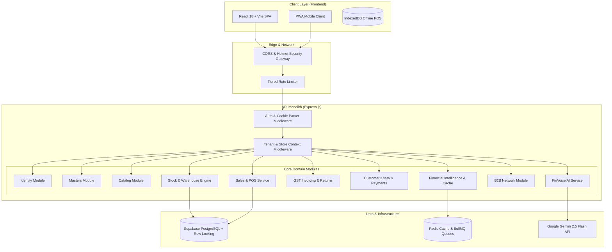

# 🌐 Karobar — Complete Project Knowledge Base & Source of Truth

> **Document Status**: `LIVING PRODUCTION SOURCE OF TRUTH`  
> **Product Name**: Karobar (कारोबार)  
> **Repository Version**: `v1.0.0-rc1 / v2.0 Modular Architecture`  
> **Last Verified Against Codebase**: August 2026  
> **Target Audience**: Engineers, Tech Leads, Architects, Core Maintainers

---

## 📌 Executive Table of Contents

1. [Project Overview](#1-project-overview)
2. [Business Domain](#2-business-domain)
3. [System Architecture](#3-system-architecture)
4. [Technology Stack](#4-technology-stack)
5. [Repository & Folder Structure](#5-repository--folder-structure)
6. [Application Modules](#6-application-modules)
7. [Feature-by-Feature Implementation Reference](#7-feature-by-feature-implementation-reference)
8. [End-to-End Workflow Specifications](#8-end-to-end-workflow-specifications)
9. [Inventory & Stock Subsystem](#9-inventory--stock-subsystem)
10. [Authentication & Authorization (IAM)](#10-authentication--authorization-iam)
11. [Database Architecture & Schema](#11-database-architecture--schema)
12. [API Contracts & Endpoints](#12-api-contracts--endpoints)
13. [Background Jobs, Queues & Redis Caching](#13-background-jobs-queues--redis-caching)
14. [AI & Voice Intelligence Architecture](#14-ai--voice-intelligence-architecture)
15. [Testing & Verification Architecture](#15-testing--verification-architecture)
16. [Security & Production Hardening](#16-security--production-hardening)

---

# 1. Project Overview

### What is Karobar?
**Karobar (कारोबार)** is an **Intelligent Business Operating System (OS) & Stock Platform** designed specifically for Indian Micro, Small, and Medium Enterprises (MSMEs) — such as Kirana stores, distributors, retail shopkeepers, and local wholesalers.

### The Problem It Solves
1. **Manual Ledger Errors & Cash Leakage**: Unrecorded sales, math errors in manual billing, and untracked discounts lead to 3–7% revenue leakage.
2. **Working Capital Crunches**: Small merchants fail because they cannot foresee cash shortfalls caused by delayed customer payments and sudden supplier bills.
3. **High Accounts Receivable (*Udhaar*)**: Overdue customer credit remains uncollected due to awkward manual chasing.
4. **Inventory Dead Stock & Stockouts**: Merchants buy products with slow turnover or run out of fast-moving items because they lack real-time stock alerts and batch expiry visibility.
5. **Language & Tech Barrier**: Most merchants are not trained accountants; they need voice-driven, regional-language interaction (Hinglish/Hindi) on mobile devices.

---

# 2. Business Domain

Karobar structures the business lifecycle into interconnected domain entities:



---

# 3. System Architecture

Karobar follows a distributed, service-oriented monolithic architecture with domain modularity and background worker processes:



---

# 4. Technology Stack

* **Frontend**: React 18, Vite 7, TailwindCSS, Lucide React, Recharts, TanStack Query, Zustand, Workbox (PWA), Axios.
* **Backend**: Node.js (ESM), Express.js 4, Zod, JWT (`jsonwebtoken`), Bcryptjs, Winston (Structured JSON logger), PDFKit, xlsx.
* **Database & Storage**: PostgreSQL via Supabase (Row-Level Security, pessimistic row locking, triggers), Supabase Storage.
* **Cache & Queues**: Redis (ioredis), BullMQ, NodeCache (in-memory fallback with event-driven synchronization).
* **AI Providers**: Google Gemini 2.5 Flash, Deepgram Nova-2 (STT).

---

# 5. Core Application Modules

### 1. Identity & Access (`backend/src/modules/identity/`)
* Multi-tenant organization bootstrap (`OrganizationBootstrapService.js`).
* Access token (15m expiry) + HttpOnly secure cookie refresh flow (30d expiry) (`AuthenticationService.js`, `TokenService.js`).
* Session tracking, brute-force lockout, active status checks, and session invalidation (`jwt_version` revocation).
* RBAC permissions matrix and staff store assignments (`RbacRepository.js`, `RbacController.js`).

### 2. Master Data (`backend/src/modules/masters/`)
* Base units of measure (UOM) with conversion multipliers (e.g., 1 Box = 24 Pcs).
* Brands, hierarchical product categories, and warehouse location management.

### 3. Product Catalog (`backend/src/modules/catalog/`)
* Multi-variant generation (Size, Color, Flavour) with automated SKU generation rules (`skuGenerator.js`).
* Primary and secondary barcode registries (EAN-13, Code 128, QR Code).
* Low stock thresholds, retail pricing, wholesale pricing, and GST tax slabs.

### 4. Stock & Warehouse Engine (`backend/src/modules/inventory/`)
* `StockService.js`: The central, single authority for all stock changes.
* `BatchSelectionEngine.js`: Automated FEFO (First-Expired, First-Out) and FIFO allocation.
* Pessimistic row locking (`SELECT FOR UPDATE`) on `warehouse_stock` to eliminate race conditions.
* Immutable partitioned stock movements ledger (`inventory_movements`).

### 5. Sales & Invoicing (`backend/src/services/SalesService.js`)
* Real-time POS checkout with barcode scanning.
* Atomic stock deduction via `StockService.deductSaleStock`.
* Multi-tax GST calculation (CGST, SGST, IGST).
* Sales returns via `StockService.returnSaleStock` / `processSalesReturn`.
* Khata debt management with partial repayments (`PaymentController.js`).

### 6. Financial Intelligence & Cache (`backend/src/utils/cache.js`)
* Tenant-isolated caching for Dashboard KPIs, Business Health Score, 14-Day Cash Flow Forecast, Credit Rules, Daily Briefs, and Anomaly Detection.
* Post-transaction invalidation hooks wired to POS sales, PO receiving, returns, repayments, and expenses.

---

# 6. End-to-End Workflow Specifications

### A. POS Checkout Flow
```
User Cart → POST /api/sales → SalesService.createSale
  ├── 1. Validate customer & pricing
  ├── 2. StockService.deductSaleStock (locks warehouse_stock, allocates FEFO batch, appends inventory_movements)
  ├── 3. Record sale & sale_items in PostgreSQL
  ├── 4. Update customer Khata if credit sale
  └── 5. Invalidate tenant Redis financial cache
```

### B. Purchase Order Receiving Flow
```
PO Received → PATCH /api/purchase-orders/:id/status (status: "received")
  ├── 1. PurchaseOrderController verifies PO ownership & transition
  ├── 2. StockService.receivePurchaseOrderStock
  │     ├── Increments warehouse on_hand and available stock
  │     ├── Inserts batch into inventory_batches
  │     └── Appends movement into inventory_movements (type: PO_RECEIPT)
  └── 3. Invalidate tenant Redis financial cache
```

### C. Offline POS Sync Flow
```
Offline Sale (IndexedDB) → Network Reconnected → OfflineSyncEngine
  ├── 1. Dispatches queued sales with client idempotency key (x-idempotency-key)
  ├── 2. Server checks duplicate idempotency key (prevents double billing)
  ├── 3. SalesService.createSale → StockService.deductSaleStock
  └── 4. Client clears local queue upon HTTP 201 / 200 response
```

---

# 7. Testing & Verification

```
Test Suites: 16 / 16 Passed
Total Tests: 85 / 85 Passed
Frontend Production Build: Vite PWA (Built in 8.91s)
```

* `tests/identity.test.js`: IAM, tokens, sessions, RBAC.
* `tests/masters.test.js`: Units, categories, brands, warehouses, tax categories.
* `tests/catalog.test.js`: Products, variants, barcodes, pricing.
* `tests/inventory.test.js`: Stock engine, reservations, movements, transfers.
* `tests/pos_stock_flow.test.js`: High-concurrency sales and rollback verification.
* `tests/catalog_frontend_flow.test.js`: Frontend catalog browsing and cart creation.
* `tests/token_refresh_flow.test.js`: Automatic 401 token refresh queueing.
* `tests/purchase_order_receiving_flow.test.js`: PO receiving and batch allocation.
* `tests/customer_khata_repayment_flow.test.js`: Khata credit balance and repayment allocation.
* `tests/sales_return_flow.test.js`: Partial and full sales return restocking.
* `tests/offline_sync_flow.test.js`: Offline POS queueing and sync deduplication.
* `tests/gst_reporting_flow.test.js`: GSTR-1, GSTR-3B tax calculations and Excel export.
* `tests/demo_accounts_auth.test.js`: Merchant and Admin credentials verification.
* `tests/financial_cache_invalidation.test.js`: Financial intelligence cache invalidation.
* `tests/production_audit.test.js`: Production security, 401 token refresh, CORS, cookie flags.
* `tests/end_to_end_workflow.test.js`: Complete 9-stage merchant workflow audit.
